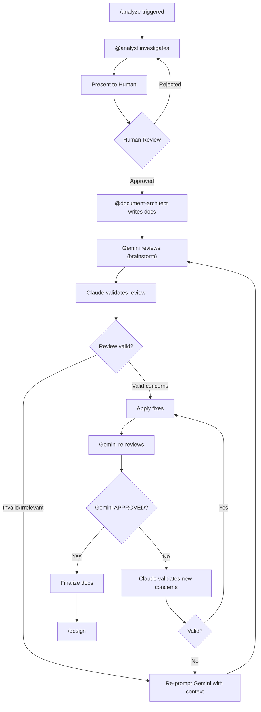

# /analyze - Analysis & Documentation Phase

## Flow



## Output Structure

```
specs/<NNN>-<feature-name>/
├── research.md      # Tech stack decisions
├── spec.md          # Requirements
├── data-model.md    # Data structures
├── plan.md          # Implementation plan
└── tasks.md         # Task breakdown
```

## Steps

### 1. Investigation

@analyst investigates codebase and requirements.

### 2. Human Review (Required)

```markdown
## Analysis Summary: [Feature Name]

### Requirements
- [Requirement 1]
- [Requirement 2]

### Technical Findings
- [Finding 1]

### Proposed Scope
- In: [items]
- Out: [items]

---
**Approve to proceed with documentation?**
```

### 3. Documentation (on approval)

@document-architect creates all docs:

1. **research.md** - Tech options, decisions, rationale
2. **spec.md** - Requirements, acceptance criteria
3. **data-model.md** - Entities, schema, relationships
4. **plan.md** - Architecture, phases, API changes
5. **tasks.md** - Task breakdown with `[P]` and `[D:XXX]`

### 4. Review Loop (until APPROVED)

```
iteration = 0
MAX_ITERATIONS = 3

while iteration < MAX_ITERATIONS:
    gemini_review = gemini-brainstorm(docs)
    
    if gemini_review.status == "APPROVED":
        break
    
    # Claude validates each concern
    for concern in gemini_review.concerns:
        if concern.is_valid and concern.is_relevant:
            apply_fix(concern)
        else:
            # Invalid concern - re-prompt with context
            add_context_for_next_review(concern.rejection_reason)
    
    iteration += 1

if iteration >= MAX_ITERATIONS:
    /escalate
```

#### Validation Criteria

For each Gemini concern, Claude checks:

| Criteria | Question |
|----------|----------|
| Specificity | Is it actionable, not generic? |
| Relevance | Applies to this project/scope? |
| Feasibility | Can be fixed within constraints? |
| Consistency | Aligns with architecture? |

#### Review Outcomes

| Gemini Says | Claude Validates | Action |
|-------------|------------------|--------|
| Concern X | Valid | Fix X, re-review |
| Concern Y | Invalid/Generic | Reject, add context |
| APPROVED | - | Proceed to /design |

### 5. Finalize & Proceed

After Gemini APPROVED → /design

## Completion

- [ ] Investigation complete
- [ ] Human approved
- [ ] All 5 docs created
- [ ] Gemini reviewed
- [ ] All valid concerns fixed
- [ ] Gemini APPROVED
- [ ] Ready for /design

## Iteration Limit

Max 3 review cycles. If not APPROVED after 3:
- /escalate with summary of remaining concerns
- Human decides: accept as-is, manual fix, or redesign
