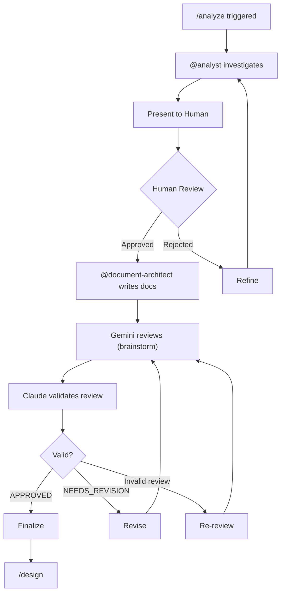

# /analyze - Analysis & Documentation Phase

## Flow



## Output Structure

```
specs/<NNN>-<feature-name>/
├── research.md      # Tech stack decisions
├── spec.md          # Requirements
├── data-model.md    # Data structures
├── plan.md          # Implementation plan
└── tasks.md         # Task breakdown
```

## Steps

### 1. Investigation

@analyst investigates codebase and requirements.

### 2. Human Review (Required)

```markdown
## Analysis Summary: [Feature Name]

### Requirements
- [Requirement 1]
- [Requirement 2]

### Technical Findings
- [Finding 1]

### Proposed Scope
- In: [items]
- Out: [items]

---
**Approve to proceed with documentation?**
```

### 3. Documentation (on approval)

@document-architect creates all docs:

1. **research.md** - Tech options, decisions, rationale
2. **spec.md** - Requirements, acceptance criteria
3. **data-model.md** - Entities, schema, relationships
4. **plan.md** - Architecture, phases, API changes
5. **tasks.md** - Task breakdown with `[P]` and `[D:XXX]`

### 4. Review & Validation

Gemini reviews → Claude validates → Finalize or revise.

### 5. Proceed

After validation → /design

## Completion

- [ ] Investigation complete
- [ ] Human approved
- [ ] All 5 docs created
- [ ] Gemini reviewed
- [ ] Review validated
- [ ] Ready for /design
