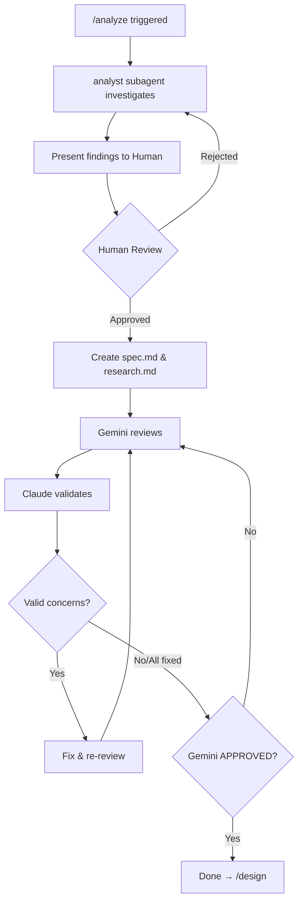

# /analyze - Analysis Phase

## Purpose

Investigation and requirements definition. Outputs: `spec.md`, `research.md`

## Output

```
specs/<NNN>-<feature-name>/
├── spec.md          # Requirements, user stories, acceptance criteria
└── research.md      # Tech options, decisions, rationale
```

## Flow



## Steps

### 1. Investigation

Use analyst subagent to investigate:
- Codebase structure
- Existing patterns
- User requirements
- Technical constraints

### 2. Human Review (Required)

Present findings and get approval before creating documents.

```markdown
## Analysis Summary: [Feature Name]

### Requirements
- [Requirement 1]
- [Requirement 2]

### Technical Findings
- [Finding 1]

### Proposed Scope
- In: [items]
- Out: [items]

---
**Approve to proceed with documentation?**
```

### 3. Document Creation (on approval)

Create using templates:

```
Template: ~/.claude/templates/spec-template.md → specs/<NNN>-<feature>/spec.md
Template: (inline research template) → specs/<NNN>-<feature>/research.md
```

#### spec.md contents

- User stories with priorities (P1, P2, P3...)
- Acceptance scenarios (Given/When/Then)
- Functional requirements
- Key entities
- Success criteria

#### research.md contents

- Technical options considered
- Decision rationale
- Constraints identified

### 4. Review Loop (until APPROVED)

```python
MAX_ITERATIONS = 3
iteration = 0

while iteration < MAX_ITERATIONS:
    review = gemini_brainstorm(spec.md, research.md)
    
    if review.status == "APPROVED":
        break
    
    for concern in review.concerns:
        if claude_validates(concern):
            apply_fix(concern)
        # Invalid concerns are ignored with context added
    
    iteration += 1

if iteration >= MAX_ITERATIONS:
    escalate()
```

### 5. Complete

After APPROVED → proceed to `/design`

## Checklist

- [ ] Investigation complete
- [ ] Human approved findings
- [ ] spec.md created
- [ ] research.md created
- [ ] Gemini APPROVED
- [ ] Ready for /design
