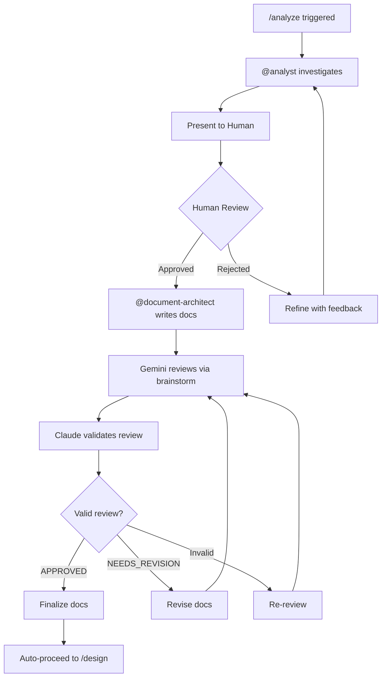

# /analyze - Analysis Phase

## Flow



## Steps

### 1. Investigation

@analyst investigates codebase and requirements.

### 2. Human Review (Required)

Present findings to human for approval:

```markdown
## Analysis Summary: [Feature Name]

### Requirements Identified
- [Requirement 1]
- [Requirement 2]

### Technical Findings
- [Finding 1]
- [Finding 2]

### Proposed Scope
- In scope: [items]
- Out of scope: [items]

### Open Questions
- [Question if any]

---
**Please review and approve to proceed with documentation.**
```

### 3. Document Creation (on approval)

@document-architect creates:

```
specs/<feature-name>/
├── spec.md    # Feature specification
├── plan.md    # Implementation plan
└── tasks.md   # Task breakdown
```

### 4. Gemini Review

Use gemini-brainstorm for collaborative review:

```
Tool: mcp__gemini__gemini-brainstorm
Params:
  prompt: "Review these documents for completeness, clarity, feasibility, and potential issues"
  claudeThoughts: "[Summary of key decisions and trade-offs]"
```

### 5. Review Validation

Claude validates Gemini's review:

| Check | Action |
|-------|--------|
| Specific feedback | Accept |
| Generic advice | Request specifics |
| Conflicts with project | Reject with reason |
| Over-engineering | Apply YAGNI |

### 6. Finalize

After valid APPROVED review → /design

## Completion

- [ ] Investigation complete
- [ ] Human approved
- [ ] spec.md, plan.md, tasks.md created
- [ ] Gemini reviewed (brainstorm)
- [ ] Review validated
- [ ] Ready for /design

## Human Intervention

**Required**: Approval before document creation.
