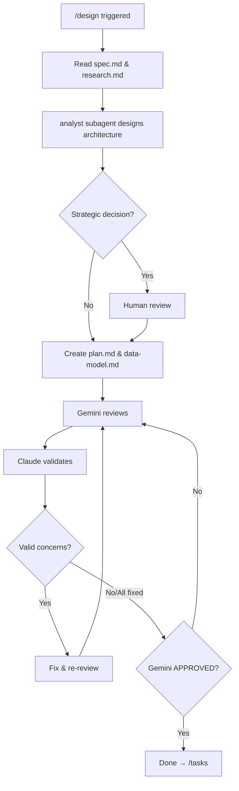

# /design - Design Phase

## Purpose

Architecture design and implementation planning. Outputs: `plan.md`, `data-model.md`

## Input

```
specs/<NNN>-<feature-name>/
├── spec.md          # From /analyze
└── research.md      # From /analyze
```

## Output

```
specs/<NNN>-<feature-name>/
├── spec.md          # (existing)
├── research.md      # (existing)
├── plan.md          # Implementation plan, architecture
└── data-model.md    # Entities, schema, relationships
```

## Flow



## Steps

### 1. Read Inputs

Load `spec.md` and `research.md` from `/analyze` phase.

### 2. Architecture Design

Use analyst subagent to design:
- Project structure
- Component architecture
- API contracts
- Data flow

### 3. Human Review (if strategic)

Only for significant architectural decisions:
- New framework/library adoption
- Major pattern changes
- Infrastructure decisions

### 4. Document Creation

Create using templates:

```
Template: ~/.claude/templates/plan-template.md → specs/<NNN>-<feature>/plan.md
Template: (inline data-model template) → specs/<NNN>-<feature>/data-model.md
```

#### plan.md contents

- Summary (from spec + research)
- Technical context (language, deps, storage, testing)
- Project structure
- Constitution check (if applicable)
- Complexity tracking

#### data-model.md contents

```markdown
# Data Model: [FEATURE]

## Entities

### [Entity Name]
- **Description**: [what it represents]
- **Attributes**:
  - `id`: [type] - [description]
  - `name`: [type] - [description]
- **Relationships**: [belongs_to, has_many, etc.]

## Schema

[If using database, include schema definition]

## Relationships Diagram

[Entity relationship diagram if complex]
```

### 5. Review Loop (until APPROVED)

```python
MAX_ITERATIONS = 3
iteration = 0

while iteration < MAX_ITERATIONS:
    review = gemini_brainstorm(plan.md, data_model.md)
    
    if review.status == "APPROVED":
        break
    
    for concern in review.concerns:
        if claude_validates(concern):
            apply_fix(concern)
    
    iteration += 1

if iteration >= MAX_ITERATIONS:
    escalate()
```

### 6. Complete

After APPROVED → proceed to `/tasks`

## Checklist

- [ ] spec.md and research.md read
- [ ] Architecture designed
- [ ] Human approved (if strategic)
- [ ] plan.md created
- [ ] data-model.md created
- [ ] Gemini APPROVED
- [ ] Ready for /tasks
