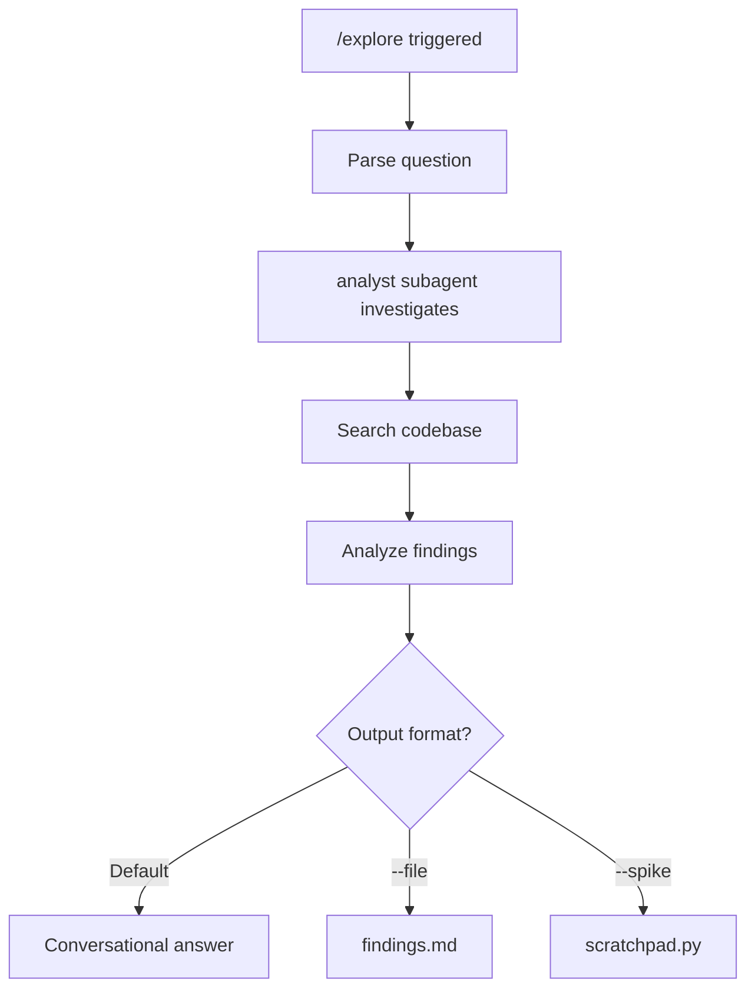

# /explore - Discovery Mode

## Purpose

Read-only investigation for understanding code without creating documents or making changes.

## Usage

```
/explore "how does authentication work?"
/explore "where is the user model defined?"
/explore "explain this error trace"
/explore "what patterns does this codebase use?"
```

## Constraints

- **READ-ONLY**: No file writes allowed
- **No spec.md**: Does not create specification documents
- **No review**: Informational output only

## Flow



## Output Formats

### Default: Conversational

Direct answer in chat:

```markdown
## Authentication Flow

The auth system uses JWT tokens:

1. Login endpoint: `src/api/auth.py:45`
2. Token generation: `src/services/jwt.py:12`
3. Middleware validation: `src/middleware/auth.py:30`

Key files:
- `src/models/user.py` - User model
- `src/services/auth_service.py` - Business logic
```

### --file: findings.md

```
/explore --file "architecture overview"
```

Creates temporary findings document:

```markdown
# Exploration: Architecture Overview

## Date: 2025-01-08

## Question
How is the codebase architected?

## Findings

### Project Structure
- Clean Architecture pattern detected
- Domain layer: `src/domain/`
- Application layer: `src/application/`
- Infrastructure: `src/infra/`

### Key Patterns
- Repository pattern for data access
- Use cases as application services
- Dependency injection via `src/di.py`

## Files Examined
- src/domain/user/models.py
- src/application/use_cases/register_user.py
- src/infra/persistence/user_repository.py
```

### --spike: scratchpad.py

For quick prototyping/testing ideas (ML workflows especially):

```
/explore --spike "test tensor shape transformation"
```

Creates temporary scratch file:

```python
# scratchpad.py - TEMPORARY (not committed)
# Exploring: tensor shape transformation

import torch

# Test idea
x = torch.randn(32, 128)
transformed = x.view(32, 4, 32)
print(f"Shape: {transformed.shape}")

# Findings:
# - view() works for contiguous tensors
# - Use reshape() for non-contiguous
```

**Note**: scratchpad.py is gitignored and not committed

## Tools Available

Read-only tools only:

| Tool | Purpose |
|------|---------|
| Glob | Find files by pattern |
| Grep | Search content |
| Read | Read file contents |
| Serena find_symbol | Locate code symbols |
| Serena get_symbols_overview | File structure |

## Restricted

These tools are **blocked** during /explore:

- Write
- Edit
- Bash (except read-only commands)
- Any file modification

## Use Cases

### Code Understanding

```
/explore "how does the payment flow work?"
/explore "what happens when a user signs up?"
```

### Debugging Support

```
/explore "explain this stack trace: [paste]"
/explore "why might this test be failing?"
```

### Architecture Mapping

```
/explore "what patterns does this project use?"
/explore "how are dependencies managed?"
```

### Pre-Implementation Research

```
/explore "where should I add a new API endpoint?"
/explore "what's the convention for error handling here?"
```

## Transition to /feat

If exploration reveals need for implementation:

```markdown
Based on exploration, this requires code changes.

Run `/feat "description"` to start implementation pipeline.
```

## Checklist

- [ ] Question understood
- [ ] Relevant files identified
- [ ] Analysis complete
- [ ] Answer provided (no files modified)
