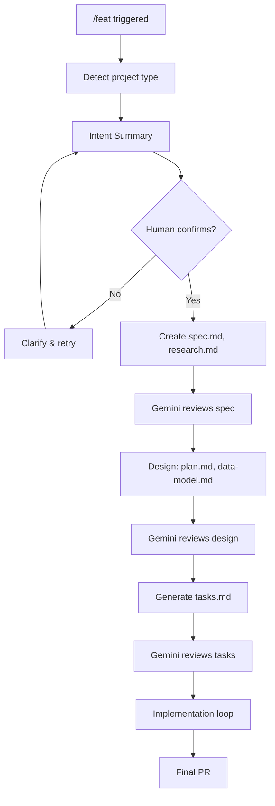

# /feat - Feature Development

## Purpose

Full feature development pipeline: Intent → Spec → Design → Tasks → Implementation

## Usage

```
/feat "feature description"              # Auto-progress (default)
/feat --interactive "feature description" # Pause at each phase
```

## Flow



## Phases

### Phase 0: Project Detection

Detect or use cached project type:
- clean-arch, cli, ml-package, python-lib, script
- Load appropriate architect persona

### Phase 1: Intent Verification

**Before any spec creation**, present:

```markdown
## Intent Summary

**Goal**: [1 sentence]

**Scope**:
- In: [items]
- Out: [items]

**Key Changes**:
1. [change 1]
2. [change 2]

**Confirm?** [Yes proceeds / No clarifies]
```

### Phase 2: Specification (spec.md, research.md)

After intent confirmed:

```
specs/<NNN>-<feature-name>/
├── spec.md          # Requirements, user stories
└── research.md      # Tech decisions, rationale
```

**Review**: Gemini → Claude validates → Fix (max 3 iterations)

### Phase 3: Design (plan.md, data-model.md)

```
specs/<NNN>-<feature-name>/
├── plan.md          # Architecture, project structure
└── data-model.md    # Entities, schema
```

**Review**: Gemini → Claude validates → Fix (max 3 iterations)

**Interactive mode**: Pause here for strategic decisions

### Phase 4: Task Breakdown (tasks.md)

```
specs/<NNN>-<feature-name>/
└── tasks.md         # Ordered task list with [P] and [USn] markers
```

**Review**: Gemini → Claude validates → Fix (max 3 iterations)

### Phase 5: Implementation

```python
for task in tasks:
    if task.files > 2:
        route_to_codex(task)
    else:
        route_to_language_expert(task)

    run_tests()
    gemini_review()

    if user_story_complete:
        git_commit()
```

**TDD Cycle**: Red → Green → Refactor

### Phase 6: Completion

```bash
git push origin <branch>
gh pr create --title "feat(<scope>): <description>"
```

## Interactive Mode

With `--interactive`, pause after:
- Intent Summary (always)
- spec.md creation
- plan.md creation
- tasks.md creation

```
/feat --interactive "Add caching layer"

> Intent Summary presented...
> [Confirm to continue]

> spec.md created...
> [Review and confirm to continue]

> plan.md created...
> [Review and confirm to continue]
...
```

## Spec Numbering

Auto-increment from existing specs:

```python
def get_next_spec_number():
    existing = glob("specs/*/")
    numbers = [int(d.split("-")[0]) for d in existing]
    return max(numbers, default=0) + 1
```

## Routing Rules

| Condition | Route |
|-----------|-------|
| 3+ files affected | Codex MCP |
| Python, 1-2 files | python-expert |
| TypeScript, 1-2 files | typescript-expert |
| Mixed frontend+backend | Multi-architect coordination |

## Review Protocol

Each phase uses:
```
MAX_ITERATIONS = 3

while iteration < MAX_ITERATIONS:
    review = gemini_brainstorm(documents)

    if review.status == "APPROVED":
        break

    for concern in review.concerns:
        if claude_validates(concern):
            apply_fix(concern)

    iteration += 1

if iteration >= MAX_ITERATIONS:
    escalate()
```

## Checklist

- [ ] Project type detected
- [ ] Intent confirmed by human
- [ ] spec.md, research.md created and APPROVED
- [ ] plan.md, data-model.md created and APPROVED
- [ ] tasks.md created and APPROVED
- [ ] All tasks implemented with TDD
- [ ] All tests passing
- [ ] PR created

## Escalation

Triggers /escalate if:
- 3 iterations without APPROVED at any phase
- Security concerns detected
- Architectural conflict with existing code
- User explicitly requests
