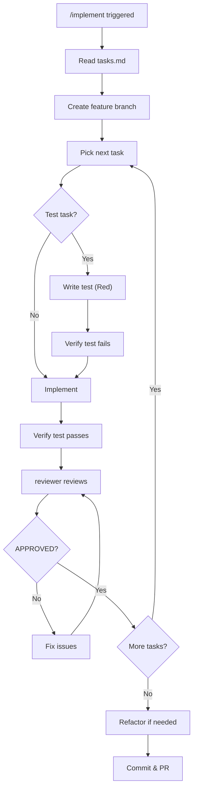

# /implement - Implementation Phase

## Purpose

Execute tasks from tasks.md using TDD cycle.

## Input

```
specs/<NNN>-<feature-name>/
├── spec.md          # Requirements
├── research.md      # Tech decisions
├── plan.md          # Architecture
├── data-model.md    # Entities
└── tasks.md         # Task list (required)
```

## Flow



## Steps

### 1. Setup

```bash
git checkout -b <NNN>-<feature-name>
```

### 2. Task Execution

Process tasks in order from tasks.md:

```python
for task in tasks:
    if task.has_parallel_marker:
        # Can batch with other [P] tasks
        pass
    
    if task.is_test:
        write_test()  # Red
        verify_test_fails()
    
    implement(task)
    verify_tests_pass()  # Green
    
    review = gemini_review(changed_files)
    while not review.approved:
        fix_concerns(review)
        review = gemini_review(changed_files)
```

### 3. TDD Cycle

For each implementation task:

1. **Red** - Write failing test first
2. **Green** - Implement to pass test
3. **Refactor** - Clean up (maintain green)

### 4. Routing

| Task Type | Route |
|-----------|-------|
| Complex (3+ files) | implementer subagent → Codex |
| Simple (1-2 files) | python-expert subagent / typescript-expert subagent |

### 5. Review Per Task

After each task completion:
- Gemini reviews changes
- Claude validates concerns
- Fix valid issues
- Continue when APPROVED

### 6. Commit Strategy

```bash
# After each user story or logical group
git add .
git commit -m "feat(<scope>): <description>"
```

### 7. Final PR

```bash
git push origin <branch>
# Create PR with summary of implemented tasks
```

## Validation Commands

### Python

```bash
ruff format
ruff check --fix
mypy src/ --strict
pytest
```

### TypeScript

```bash
npm run lint -- --fix
tsc --noEmit
npm test
npm run build
```

## Checklist

- [ ] tasks.md loaded
- [ ] Feature branch created
- [ ] All tasks completed
- [ ] Tests passing
- [ ] Gemini APPROVED each task
- [ ] Code committed
- [ ] PR created

## Iteration Limit

Max 3 review iterations per task. If exceeded → /escalate
