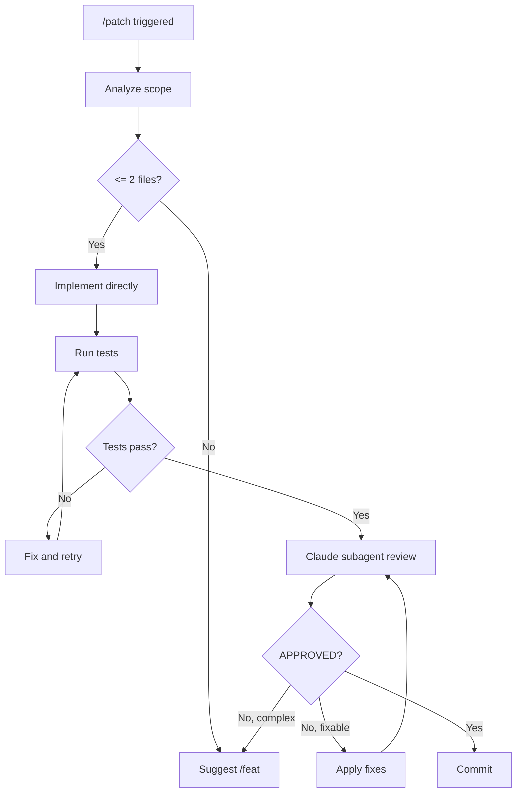

# /patch - Quick Fix

## Purpose

Lightweight path for small changes (1-2 files) without full specification.

## Usage

```
/patch "fix typo in README"
/patch "add validation to email field"
```

## Constraints

- **Max 2 files** modified
- **No architectural changes**
- **No new dependencies** (runtime)
- **Existing tests must pass**

If any constraint violated → suggest `/feat` instead

## Flow



## Steps

### 1. Scope Analysis

```python
def analyze_scope(request):
    affected_files = estimate_affected_files(request)

    if len(affected_files) > 2:
        return SuggestFeat("Scope exceeds 2 files")

    if requires_new_dependency(request):
        return SuggestFeat("Requires new runtime dependency")

    if impacts_architecture(request):
        return SuggestFeat("Architectural impact detected")

    return ProceedWithPatch()
```

### 2. Implementation

Route based on project type:
- Python → python-expert subagent
- TypeScript → typescript-expert subagent

**No spec.md, plan.md, or tasks.md created**

### 3. Test Execution

```bash
# Python
ruff check --fix
mypy src/ --strict
pytest

# TypeScript
npm run lint -- --fix
tsc --noEmit
npm test
```

### 4. Claude Subagent Review

Spawn reviewer subagent (separate context):

```markdown
## Review Request

**Change**: [description]
**Files**: [list]
**Diff**: [git diff]

## Checklist
- [ ] Change matches request
- [ ] No unintended side effects
- [ ] Test coverage maintained
- [ ] Follows existing patterns
- [ ] No security issues

## Decision
- APPROVED: Proceed to commit
- NEEDS_FIX: [specific issues]
- ESCALATE: Too complex for /patch
```

### 5. Commit

```bash
git add <files>
git commit -m "fix(<scope>): <description>"
```

**No PR created** for /patch (direct commit to current branch)

## Review Protocol

```python
MAX_REVIEW_ITERATIONS = 2  # Stricter than /feat

for iteration in range(MAX_REVIEW_ITERATIONS):
    review = claude_subagent_review(changes)

    if review.status == "APPROVED":
        commit()
        break
    elif review.status == "ESCALATE":
        suggest_feat()
        break
    else:  # NEEDS_FIX
        apply_fixes(review.issues)

else:
    # Max iterations reached
    suggest_feat()
```

## Escalation to /feat

When /patch is insufficient:

```markdown
This change exceeds /patch scope:
- [reason]

Recommended: Run `/feat "original request"` for full pipeline.
```

## Examples

### Good /patch candidates

```
/patch "fix typo in error message"
/patch "add null check to user lookup"
/patch "update copyright year in footer"
/patch "rename variable for clarity"
```

### Should use /feat instead

```
/patch "add caching layer"          → Too architectural
/patch "refactor auth module"       → Too many files
/patch "add new API endpoint"       → New feature
/patch "integrate Redis"            → New dependency
```

## Checklist

- [ ] Scope <= 2 files
- [ ] No architectural impact
- [ ] No new runtime dependencies
- [ ] Implementation complete
- [ ] Tests passing
- [ ] Claude subagent APPROVED
- [ ] Committed
