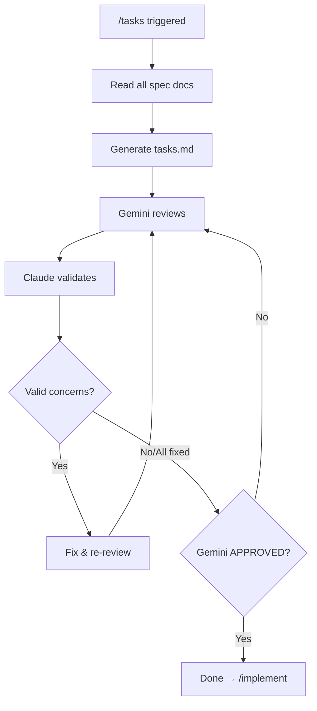

# /tasks - Task Breakdown Phase

## Purpose

Create detailed task list for implementation. Output: `tasks.md`

## Input

```
specs/<NNN>-<feature-name>/
├── spec.md          # User stories (required)
├── research.md      # Tech decisions
├── plan.md          # Architecture (required)
└── data-model.md    # Entities
```

## Output

```
specs/<NNN>-<feature-name>/
├── spec.md          # (existing)
├── research.md      # (existing)
├── plan.md          # (existing)
├── data-model.md    # (existing)
└── tasks.md         # Detailed task breakdown
```

## Flow



## Steps

### 1. Read Inputs

Load all documents from previous phases:
- `spec.md` - User stories with priorities
- `plan.md` - Project structure, architecture
- `data-model.md` - Entities to implement

### 2. Generate tasks.md

Use template: `~/.claude/templates/tasks-template.md`

#### Task Format

```
[ID] [P?] [Story] Description
```

- **ID**: Task identifier (T001, T002, ...)
- **[P]**: Parallel marker - can run concurrently
- **[Story]**: User story reference (US1, US2, ...)

#### Phase Structure

1. **Setup** - Project initialization
2. **Foundational** - Core infrastructure (BLOCKS all stories)
3. **User Story 1** (P1) - MVP
4. **User Story 2** (P2)
5. **User Story N** (PN)
6. **Polish** - Cross-cutting concerns

#### Example Tasks

```markdown
## Phase 1: Setup

- [ ] T001 Create project structure per implementation plan
- [ ] T002 Initialize Python project with FastAPI dependencies
- [ ] T003 [P] Configure ruff and pre-commit hooks

## Phase 2: Foundational

- [ ] T004 Setup database schema and migrations
- [ ] T005 [P] Implement authentication framework
- [ ] T006 [P] Setup API routing structure

## Phase 3: User Story 1 - User Registration (P1) 🎯 MVP

### Implementation

- [ ] T010 [P] [US1] Create User model in src/models/user.py
- [ ] T011 [P] [US1] Create UserRepository in src/repositories/user.py
- [ ] T012 [US1] Implement RegisterUserUseCase in src/use_cases/register.py
- [ ] T013 [US1] Add POST /users endpoint in src/api/users.py
```

### 3. Review Loop (until APPROVED)

```python
MAX_ITERATIONS = 3
iteration = 0

while iteration < MAX_ITERATIONS:
    review = gemini_brainstorm(tasks.md)
    
    if review.status == "APPROVED":
        break
    
    for concern in review.concerns:
        if claude_validates(concern):
            apply_fix(concern)
    
    iteration += 1

if iteration >= MAX_ITERATIONS:
    escalate()
```

### 4. Complete

After APPROVED → proceed to `/implement`

## Task Guidelines

### Parallel Markers [P]

Use when tasks:
- Touch different files
- Have no dependencies
- Can be executed concurrently

### Story Labels [USn]

- Map every implementation task to a user story
- Enables tracking progress per story
- Allows MVP delivery (just US1)

### Dependencies

- Within story: Models → Services → Endpoints
- Between stories: Generally independent
- Foundational blocks all stories

## Checklist

- [ ] All spec docs read
- [ ] tasks.md created
- [ ] Tasks organized by user story
- [ ] Parallel markers added
- [ ] Dependencies documented
- [ ] Gemini APPROVED
- [ ] Ready for /implement


