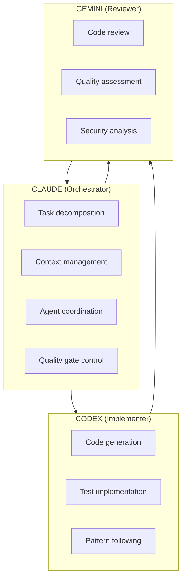

# Development Workflow Core

Shared foundation for the 3-agent development workflow.

## Overview

## Core Principles

1. **Separation of Concerns**: Each agent has distinct responsibilities
2. **Iteration Control**: Maximum 3 cycles before human intervention
3. **Review Validation**: Gemini reviews are validated, not blindly accepted
4. **Evidence-Based**: All decisions backed by code or documentation

## References

- `workflow/3-agent-overview.md` - Detailed workflow phases
- `workflow/iteration-control.md` - Loop prevention protocol
- `workflow/review-validation.md` - Review outcome handling
- `workflow/bug-fix.md` - Bug fix specific workflow
- `templates/human-intervention.md` - Escalation template
- `templates/adr.md` - Architecture Decision Record
