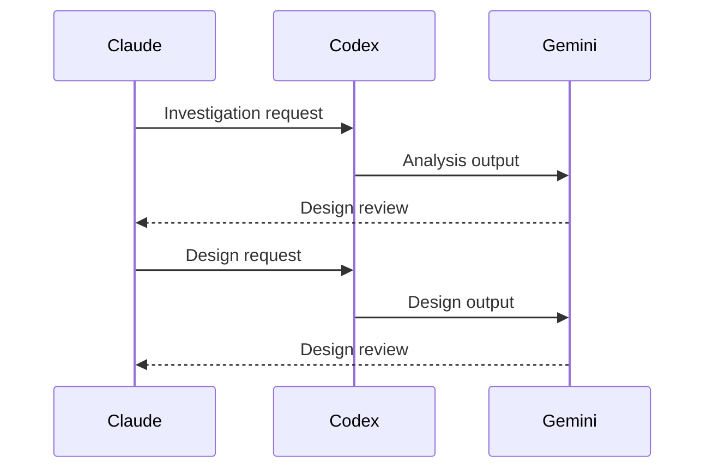
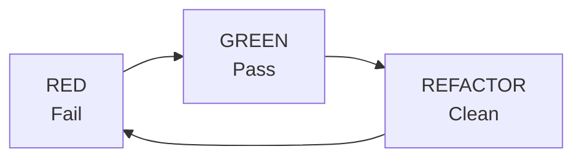
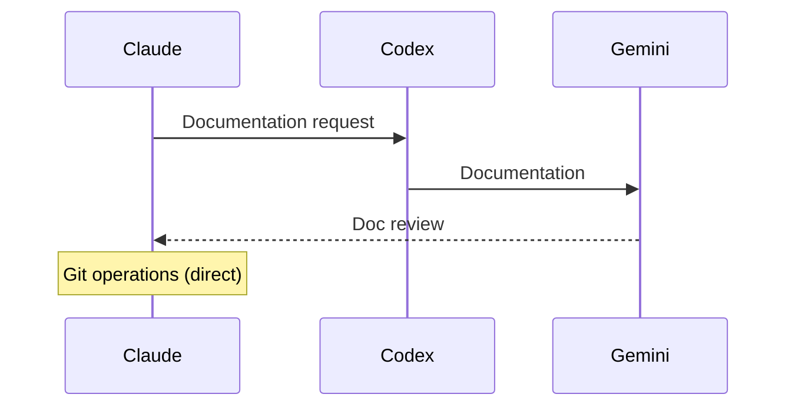

# 3-Agent Development Workflow

## Workflow Phases

### Phase 1: Analysis & Design



### Phase 2: Implementation (TDD)



**Red Phase**
1. Claude requests test creation from Codex
2. Codex generates failing tests
3. Claude verifies tests fail

**Green Phase**
1. Claude requests minimal implementation from Codex
2. Codex generates code to pass tests
3. Claude verifies tests pass
4. Gemini reviews implementation

**Refactor Phase**
1. Claude requests refactoring analysis from Codex
2. Codex identifies improvements
3. Claude applies changes
4. Verify tests still pass

### Phase 3: Integration & Documentation



## Agent Responsibilities

### Claude (Orchestrator)

**Always Handles Directly:**
- Git operations (branch, commit, push, PR)
- File creation/deletion
- Running tests and linters
- Context management
- Task decomposition

**Delegates to Codex:**
- Code implementation
- Test creation
- Design decisions

**Delegates to Gemini:**
- Code review
- Security analysis
- Documentation review

### Codex (Implementer)

**Strengths:**
- Following established patterns
- Implementing from clear specifications
- Test-driven development

**Limitations:**
- Rate limits (Claude can fallback)
- Complex architectural decisions
- Cross-system analysis

### Gemini (Reviewer)

**Review Types:**
- Design review (interfaces, types)
- Implementation review (logic, patterns)
- Security review (vulnerabilities, dependencies)
- Documentation review (completeness, clarity)

## Codex Fallback Protocol

When Codex is rate-limited or unavailable:

```python
if codex.rate_limited:
    claude.implement_directly()
    # Still send to Gemini for review
```

Claude should:
1. Log that fallback is being used
2. Follow same patterns Codex would use
3. Still submit to Gemini for review
4. Not skip any quality gates
