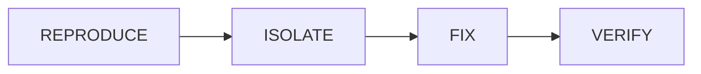

# Bug Fix Workflow

## Overview

Bug fixing requires a different approach than feature development. The focus is on reproduction, isolation, and verification.

## Workflow Phases



## Phase 1: Reproduce

**Goal**: Confirm the bug exists and create a failing test.

### Steps

1. **Understand the Report**
   - What is the expected behavior?
   - What is the actual behavior?
   - What are the reproduction steps?

2. **Create Reproduction Test**
   ```
   Codex Prompt:
   Background: Bug report - [description]
   Purpose: Create failing test that demonstrates the bug
   Constraints:
   - Test must fail with current code
   - Test must pass when bug is fixed
   - Include edge cases if applicable

   Task: Create test in tests/[module]/[bug-name].test.[ext]
   ```

3. **Verify Test Fails**
   - Run test to confirm it fails
   - If test passes, bug may already be fixed or test is incorrect

## Phase 2: Isolate

**Goal**: Identify the root cause.

### Steps

1. **Analyze Stack Trace** (if available)
   ```
   Codex Prompt:
   Background: Bug with failing test
   Purpose: Identify root cause
   Constraints:
   - Trace execution path
   - Identify where behavior diverges from expected

   Task: Analyze and report:
   1. Entry point
   2. Path to failure
   3. Suspected root cause
   4. Affected components
   ```

2. **Verify Isolation**
   - Confirm the identified cause explains the bug
   - Check if there are multiple contributing factors

## Phase 3: Fix

**Goal**: Implement minimal fix that resolves the issue.

### Steps

1. **Request Fix**
   ```
   Codex Prompt:
   Background: Bug with identified root cause
   Purpose: Implement minimal fix
   Constraints:
   - Fix ONLY the identified issue
   - Do NOT refactor surrounding code
   - Maintain backward compatibility
   - No feature additions

   Root Cause: [identified cause]

   Task: Implement fix
   ```

2. **Verify Test Passes**
   - Run the reproduction test
   - Must now pass

## Phase 4: Verify

**Goal**: Ensure fix doesn't break anything else.

### Steps

1. **Run Full Test Suite**
   ```bash
   npm run test  # or pytest
   ```

2. **Regression Check with Gemini**
   ```
   Gemini Prompt:
   Review this bug fix for side effects.

   [Original code]
   [Fixed code]
   [Bug description]

   Evaluate:
   - Could this fix break other functionality?
   - Are there similar patterns that might have the same bug?
   - Is the fix minimal and focused?

   Format: APPROVED / NEEDS_REVISION
   ```

3. **Check Related Code**
   - Search for similar patterns
   - Consider if same bug exists elsewhere

## Git Strategy for Bug Fixes

### Branch Naming

```
fix/[issue-number]-[short-description]
fix/123-null-pointer-user-service
```

### Commit Structure

```bash
# Commit 1: Add reproduction test
git commit -m "test(user): add reproduction test for null pointer bug

Reproduces issue #123 where user service crashes on null input."

# Commit 2: Implement fix
git commit -m "fix(user): handle null input in user service

Adds null check before processing user data.
Closes #123"
```

## Checklist

- [ ] Bug reproduced with failing test
- [ ] Root cause identified and documented
- [ ] Fix is minimal (no refactoring, no features)
- [ ] Reproduction test now passes
- [ ] Full test suite passes
- [ ] Gemini review: APPROVED
- [ ] Related code checked for similar issues
- [ ] Commits follow convention
