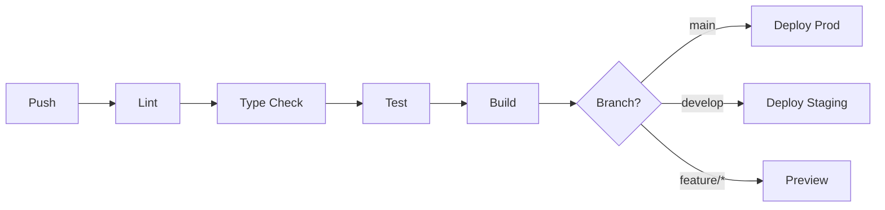
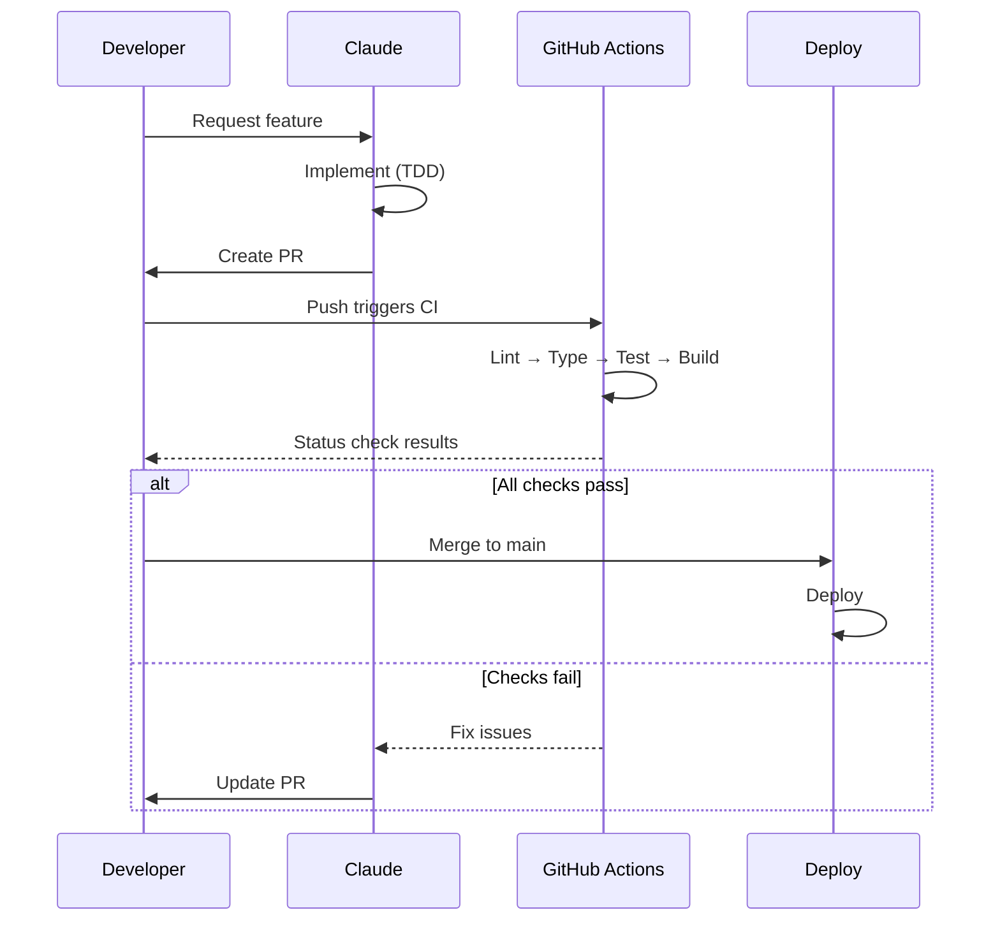

# CI/CD Integration Guide

## Overview



## GitHub Actions

### Python Workflow

```yaml
# .github/workflows/python.yml
name: Python CI

on:
  push:
    branches: [main, develop]
  pull_request:
    branches: [main, develop]

jobs:
  lint:
    runs-on: ubuntu-latest
    steps:
      - uses: actions/checkout@v4
      - uses: astral-sh/setup-uv@v4
      - run: uv sync
      - run: uv run ruff check .
      - run: uv run ruff format --check .

  type-check:
    runs-on: ubuntu-latest
    steps:
      - uses: actions/checkout@v4
      - uses: astral-sh/setup-uv@v4
      - run: uv sync
      - run: uv run mypy src/ --strict

  test:
    runs-on: ubuntu-latest
    needs: [lint, type-check]
    steps:
      - uses: actions/checkout@v4
      - uses: astral-sh/setup-uv@v4
      - run: uv sync
      - run: uv run pytest --cov=src --cov-report=xml
      - uses: codecov/codecov-action@v4
        with:
          files: coverage.xml

  build:
    runs-on: ubuntu-latest
    needs: test
    steps:
      - uses: actions/checkout@v4
      - uses: astral-sh/setup-uv@v4
      - run: uv build
```

### TypeScript/Next.js Workflow

```yaml
# .github/workflows/nextjs.yml
name: Next.js CI

on:
  push:
    branches: [main, develop]
  pull_request:
    branches: [main, develop]

jobs:
  lint:
    runs-on: ubuntu-latest
    steps:
      - uses: actions/checkout@v4
      - uses: actions/setup-node@v4
        with:
          node-version: "20"
          cache: "npm"
      - run: npm ci
      - run: npm run lint

  type-check:
    runs-on: ubuntu-latest
    steps:
      - uses: actions/checkout@v4
      - uses: actions/setup-node@v4
        with:
          node-version: "20"
          cache: "npm"
      - run: npm ci
      - run: npx tsc --noEmit

  test:
    runs-on: ubuntu-latest
    needs: [lint, type-check]
    steps:
      - uses: actions/checkout@v4
      - uses: actions/setup-node@v4
        with:
          node-version: "20"
          cache: "npm"
      - run: npm ci
      - run: npm run test -- --coverage
      - uses: codecov/codecov-action@v4

  build:
    runs-on: ubuntu-latest
    needs: test
    steps:
      - uses: actions/checkout@v4
      - uses: actions/setup-node@v4
        with:
          node-version: "20"
          cache: "npm"
      - run: npm ci
      - run: npm run build
```

## Pre-commit Hooks

### Setup with Husky

```bash
# Install
npm install -D husky lint-staged

# Initialize
npx husky init

# Add pre-commit hook
echo "npx lint-staged" > .husky/pre-commit
```

### lint-staged Configuration

```json
// package.json
{
  "lint-staged": {
    "*.{ts,tsx}": ["eslint --fix", "prettier --write"],
    "*.{json,md}": ["prettier --write"]
  }
}
```

### Python Pre-commit

```yaml
# .pre-commit-config.yaml
repos:
  - repo: https://github.com/astral-sh/ruff-pre-commit
    rev: v0.8.0
    hooks:
      - id: ruff
        args: [--fix]
      - id: ruff-format

  - repo: https://github.com/pre-commit/mirrors-mypy
    rev: v1.13.0
    hooks:
      - id: mypy
        additional_dependencies: [pydantic]
```

## Deployment Strategies

### Vercel (Next.js)

```json
// vercel.json
{
  "buildCommand": "npm run build",
  "outputDirectory": ".next",
  "framework": "nextjs",
  "regions": ["iad1"],
  "env": {
    "NEXT_PUBLIC_API_URL": "@api-url"
  }
}
```

### Docker (Python)

```dockerfile
# Dockerfile
FROM python:3.13-slim

WORKDIR /app

# Install uv
COPY --from=ghcr.io/astral-sh/uv:latest /uv /usr/local/bin/uv

# Copy dependency files
COPY pyproject.toml uv.lock ./

# Install dependencies
RUN uv sync --frozen --no-dev

# Copy source
COPY src/ ./src/

# Run
CMD ["uv", "run", "uvicorn", "src.main:app", "--host", "0.0.0.0"]
```

## Branch Protection Rules

### Recommended Settings

```yaml
# Branch: main
protection_rules:
  require_pull_request: true
  required_approvals: 1
  require_status_checks:
    - lint
    - type-check
    - test
    - build
  require_linear_history: true
  require_signed_commits: false
  allow_force_pushes: false
  allow_deletions: false
```

## Workflow Integration

### With 3-Agent Workflow



## CI/CD Checklist

- [ ] Lint step configured
- [ ] Type check step configured
- [ ] Test step with coverage
- [ ] Build step
- [ ] Pre-commit hooks installed
- [ ] Branch protection enabled
- [ ] Required status checks defined
- [ ] Deployment pipeline configured
