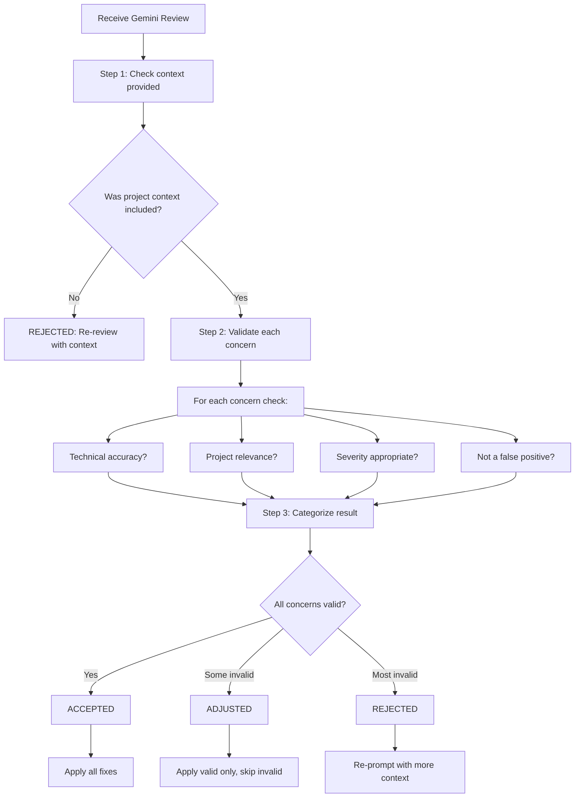

# Review Validation Protocol

## Purpose

Gemini reviews are valuable but not infallible. **Every Gemini review MUST be validated by Claude before acting.**

Without validation:
- False positives waste time fixing non-issues
- False negatives miss real problems
- Generic advice conflicts with project patterns
- Over-engineering suggestions violate YAGNI

## Validation Flow



## Step-by-Step Validation Process

### Step 1: Verify Context Was Provided

Before accepting any review, confirm Gemini received:

- [ ] Project type (clean-arch, cli, ml-package, etc.)
- [ ] Tech stack (dependencies, versions)
- [ ] Project conventions/patterns
- [ ] Related existing code (if relevant)

**If context was missing → REJECTED, re-review with context.**

### Step 2: Validate Each Concern

For **every concern** Gemini raised, Claude asks:

| Question | If No |
|----------|-------|
| Is this technically accurate? | Mark as false positive |
| Does this apply to this project? | Mark as irrelevant |
| Is severity (Critical/Major/Minor) correct? | Adjust severity |
| Does this conflict with existing patterns? | Check project conventions |
| Is this actionable without over-engineering? | Apply YAGNI |

### Step 3: Categorize Validation Result

| Result | Criteria | Action |
|--------|----------|--------|
| **ACCEPTED** | All concerns valid and applicable | Apply all fixes |
| **ADJUSTED** | Some concerns invalid or need modification | Apply valid only, document skips |
| **REJECTED** | Most concerns invalid, context clearly missing | Re-prompt with better context |

### Step 4: Document Validation

**Always output validation summary before proceeding:**

```markdown
## Review Validation

**Result**: [ACCEPTED / ADJUSTED / REJECTED]

**Concerns Analysis**:
- [Concern 1]: ✓ Valid - will fix
- [Concern 2]: ✗ False positive - [reason]
- [Concern 3]: ⚠ Adjusted severity from Critical to Minor

**Action**: [What will be done]
```

## Validation Criteria

### Check for Over-Criticism

| Signal | Example | Action |
|--------|---------|--------|
| Generic advice | "Add more tests" without specifics | Request specifics |
| Pattern conflict | Suggests different architecture | Check project patterns |
| Over-engineering | Wants abstraction for single use | Apply YAGNI |
| Style preference | Tabs vs spaces (project uses spaces) | Follow project style |

### Check for Under-Criticism

| Gap | Risk | Action |
|-----|------|--------|
| No security review | Vulnerabilities | Request security focus |
| No accessibility check | WCAG violations | Request a11y review |
| No error handling review | Runtime crashes | Request error focus |
| No performance mention | Slow code | Request perf review |

## Outcome Definitions

### REVIEW_ACCEPTED

All Gemini suggestions are valid and applicable.

```markdown
Review Validation: REVIEW_ACCEPTED
- All concerns address real issues
- Suggestions align with project patterns
- No conflicting recommendations
Action: Apply all changes
```

### REVIEW_ADJUSTED

Some suggestions valid, others modified or skipped.

```markdown
Review Validation: REVIEW_ADJUSTED

Applied:
- [Concern 1]: Fixed as suggested
- [Concern 2]: Fixed as suggested

Adjusted:
- [Concern 3]:
  - Gemini suggested: [original]
  - Applied instead: [modification]
  - Reason: [why adjustment needed]

Skipped:
- [Concern 4]:
  - Gemini suggested: [original]
  - Reason for skip: [project constraint or pattern]
```

### REVIEW_REJECTED

Review contains fundamental errors or conflicts.

```markdown
Review Validation: REVIEW_REJECTED

Rejected concerns:
- [Concern]: [Gemini's suggestion]
  - Rejection reason: [why not applicable]
  - Evidence: [project pattern, documentation, or constraint]

Action: Proceeding without changes
Note: Consider re-review with adjusted prompt
```

## Re-Review Protocol

When review is rejected or heavily adjusted:

1. **Provide More Context**: Include project patterns in next prompt
2. **Narrow Scope**: Ask for review of specific aspect only
3. **Ask for Validation**: "Validate your review against these constraints: [...]"

## Self-Validation Prompt

Use this prompt to have Gemini self-check:

```
Evaluate your previous review against these criteria:

1. Are concerns project-specific or generic best practices?
2. Do suggestions conflict with existing patterns in the codebase?
3. Is the severity categorization appropriate?
4. Are there any false positives based on common patterns?

Provide adjusted review if needed.
```
