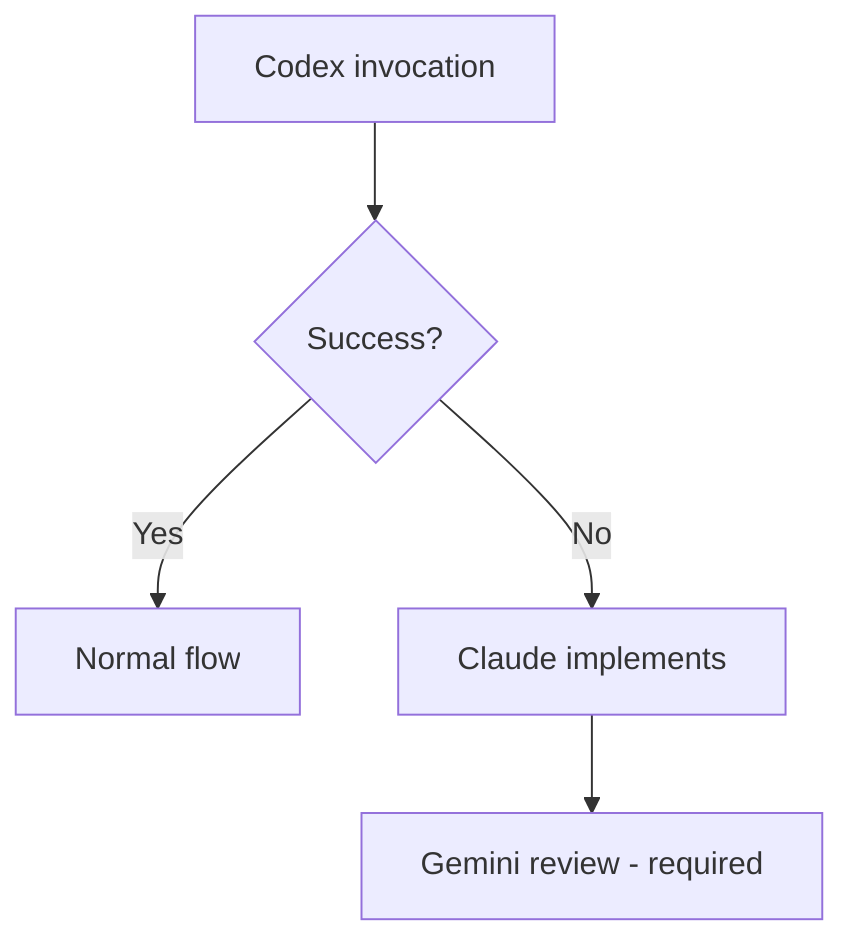
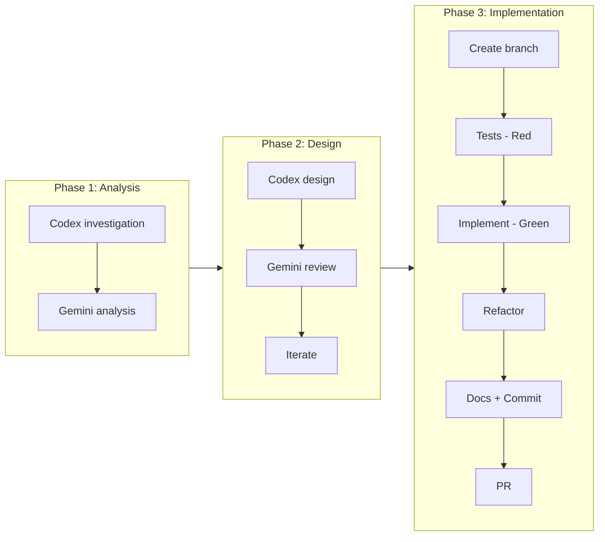

# Python Development Skill

## Contents

| Directory | Description |
|-----------|-------------|
| workflow/ | Workflow details, prompt templates, git workflow |
| guides/ | Coding standards, architecture, testing, documentation |
| examples/ | Step-by-step implementation examples |
| templates/ | Code templates (pydantic entities, repositories) |
| scripts/ | Validation scripts |
| checklists/ | Phase checklists |

## Shared Patterns

@~/.claude/skills/dev-workflow-core/SKILL.md

---

## Prime Directives

### 1. Role Assignment

| Agent | Normal | Codex Unavailable |
|-------|--------|-------------------|
| **Claude** | Orchestration, decisions | Decisions + implementation |
| **Codex** | Code implementation | — |
| **Gemini** | Review, quality assessment | Review (required) |

### 2. Claude Direct Execution

The following do NOT require Codex:
- Git operations (commit, push, PR)
- File creation/deletion
- Minor fixes (1-2 lines)
- Implementation during Codex rate limits

### 3. Codex Fallback



### 4. Complete Resolution Principle

Iterate until Gemini returns "no concerns". Never settle for partial fixes.

@~/.claude/skills/dev-workflow-core/workflow/iteration-control.md

---

## Quick Start

### Basic Flow



---

## Coding Standards (Summary)

@~/.claude/skills/python-dev/guides/coding-standards.md

### Type Hints (Python 3.12+)

```python
# ✅ Modern
def process(value: str | None) -> list[str]: ...

# ❌ Legacy
from typing import Optional, List
def process(value: Optional[str]) -> List[str]: ...
```

### Async (Optional)

```python
# Sync (default)
def fetch(url: str) -> dict: ...

# Async (when needed, use anyio)
import anyio
async def fetch(url: str) -> dict: ...
```

---

## Validation Commands

```bash
# Format & Lint
ruff format && ruff check --fix

# Type check
mypy src/ --strict

# Test
pytest --cov=src
```
