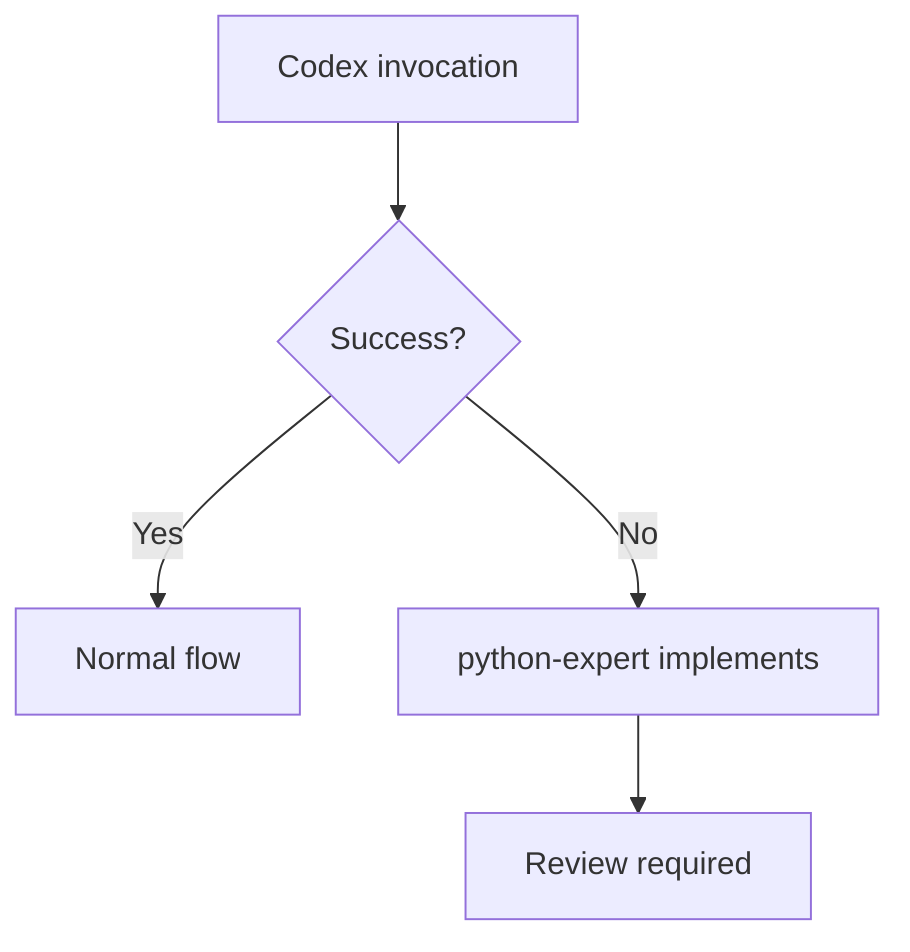

# Python Development Skill

## Contents

| Directory | Description |
|-----------|-------------|
| workflow/ | Workflow details, prompt templates, git workflow |
| guides/ | Coding standards, architecture, testing, documentation |
| examples/ | Step-by-step implementation examples |
| templates/ | Code templates (pydantic entities, repositories) |
| scripts/ | Validation scripts |
| checklists/ | Phase checklists |

## Shared Patterns

See `~/.claude/skills/dev-workflow-core/SKILL.md`

---

## Workflow Integration

### Track Selection

| Scenario | Track | Example |
|----------|-------|---------|
| New feature | /feat | "Add user authentication" |
| Bug fix, typo, minor change | /patch | "Fix validation in user model" |
| Code understanding | /explore | "How does the auth flow work?" |

### /feat for Python

```
/feat "Add caching to API responses"

1. Intent verification
2. spec.md (requirements)
3. plan.md (architecture per project profile)
4. tasks.md (ordered implementation)
5. TDD implementation
6. PR
```

### /patch for Python

```
/patch "Fix null check in user lookup"

1. Scope check (≤2 files)
2. python-expert implements
3. Tests pass
4. Claude subagent review
5. Commit
```

---

## Project Profiles

Automatically detected or set via `/mode`:

| Profile | Use Case | Complexity |
|---------|----------|------------|
| clean-arch | FastAPI services, DDD | High |
| cli | Command-line tools | Medium |
| ml-package | Training/inference pipelines | Medium-High |
| python-lib | Reusable packages | Medium |
| script | One-off utilities | Low |

See `~/.claude/agents/backend-architect.md` for profile details.

---

## Prime Directives

### 1. Role Assignment

| Agent | /feat | /patch |
|-------|-------|--------|
| **Claude** | Orchestration | Coordination |
| **Codex** | Complex (3+ files) | — |
| **python-expert** | Simple (1-2 files) | Implementation |
| **Gemini** | Full review | — |
| **Claude Subagent** | — | Light review |

### 2. Claude Direct Execution

The following do NOT require Codex:
- Git operations (commit, push, PR)
- File creation/deletion
- Minor fixes (1-2 lines)
- /patch implementations

### 3. Codex Fallback



### 4. Complete Resolution Principle

Iterate until reviewer returns "APPROVED". Never settle for partial fixes.

---

## Coding Standards (Summary)

See `guides/coding-standards.md` for full details.

### Type Hints (Python 3.12+)

```python
# ✅ Modern
def process(value: str | None) -> list[str]: ...

# ❌ Legacy
from typing import Optional, List
def process(value: Optional[str]) -> List[str]: ...
```

### Async (Optional)

```python
# Sync (default)
def fetch(url: str) -> dict: ...

# Async (when needed, use anyio)
import anyio
async def fetch(url: str) -> dict: ...
```

---

## Validation Commands

```bash
# Format & Lint
ruff format && ruff check --fix

# Type check
mypy src/ --strict

# Test
pytest --cov=src
```
