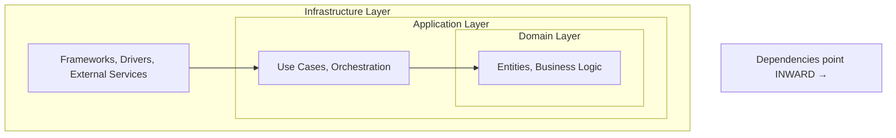

# Clean Architecture Guide

## Layer Overview



**Rule**: Outer layers depend on inner layers. Inner layers know nothing about outer layers.

---

## Directory Structure

```
src/
├── domain/                    # Core business logic (NO external deps)
│   ├── entities/
│   │   ├── __init__.py
│   │   └── user.py
│   ├── value_objects/
│   │   ├── __init__.py
│   │   └── email.py
│   ├── repositories/          # Interfaces (Ports)
│   │   ├── __init__.py
│   │   └── user_repository.py
│   ├── services/              # Domain services
│   │   ├── __init__.py
│   │   └── pricing_service.py
│   └── exceptions.py
│
├── application/               # Use cases (depends on Domain only)
│   ├── use_cases/
│   │   ├── __init__.py
│   │   ├── create_user.py
│   │   └── get_user.py
│   ├── services/              # Application services
│   │   ├── __init__.py
│   │   └── notification_service.py
│   └── dto/                   # Data Transfer Objects
│       ├── __init__.py
│       └── user_dto.py
│
└── infrastructure/            # External concerns (implements interfaces)
    ├── repositories/
    │   ├── __init__.py
    │   └── postgres_user_repository.py
    ├── web/
    │   ├── __init__.py
    │   └── fastapi_routes.py
    ├── database/
    │   ├── __init__.py
    │   └── session.py
    └── external/
        ├── __init__.py
        └── stripe_client.py
```

---

## Layer Rules

### Domain Layer

**Dependencies**: None (pure Python only)

**Contains**:
- Entities (business objects with identity)
- Value Objects (immutable, no identity)
- Repository Interfaces (ports)
- Domain Services (stateless business logic)
- Domain Exceptions

**Rules**:
- NO imports from application or infrastructure
- NO framework dependencies
- Pure Python with type hints

```python
# domain/entities/user.py
from dataclasses import dataclass
from uuid import UUID
from domain.value_objects.email import Email

@dataclass
class User:
    id: UUID
    email: Email
    name: str
    is_active: bool = True
```

```python
# domain/repositories/user_repository.py
from abc import ABC, abstractmethod
from domain.entities.user import User
from domain.value_objects.email import Email

class UserRepository(ABC):
    @abstractmethod
    def save(self, user: User) -> None:
        pass

    @abstractmethod
    def find_by_email(self, email: Email) -> User | None:
        pass
```

### Application Layer

**Dependencies**: Domain layer only

**Contains**:
- Use Cases (application-specific business rules)
- Application Services (orchestration)
- DTOs (data transfer objects)

**Rules**:
- Imports from domain only
- Defines what the application does
- Orchestrates domain objects

```python
# application/use_cases/create_user.py
from dataclasses import dataclass
from domain.entities.user import User
from domain.repositories.user_repository import UserRepository
from domain.value_objects.email import Email

@dataclass
class CreateUserInput:
    email: str
    name: str

@dataclass
class CreateUserOutput:
    user_id: str

class CreateUserUseCase:
    def __init__(self, user_repository: UserRepository) -> None:
        self.user_repository = user_repository

    def execute(self, input_data: CreateUserInput) -> CreateUserOutput:
        email = Email(input_data.email)

        existing = self.user_repository.find_by_email(email)
        if existing:
            raise ValueError("Email already registered")

        user = User.create(email=email, name=input_data.name)
        self.user_repository.save(user)

        return CreateUserOutput(user_id=str(user.id))
```

### Infrastructure Layer

**Dependencies**: Domain and Application layers

**Contains**:
- Repository Implementations
- Framework code (FastAPI, Django)
- Database access
- External service clients

**Rules**:
- Implements interfaces from domain
- Contains all framework-specific code
- Handles external concerns

```python
# infrastructure/repositories/postgres_user_repository.py
from sqlalchemy.orm import Session
from domain.entities.user import User
from domain.repositories.user_repository import UserRepository
from domain.value_objects.email import Email

class PostgresUserRepository(UserRepository):
    def __init__(self, session: Session) -> None:
        self.session = session

    def save(self, user: User) -> None:
        model = UserModel.from_entity(user)
        self.session.add(model)
        self.session.commit()

    def find_by_email(self, email: Email) -> User | None:
        model = self.session.query(UserModel).filter_by(
            email=email.value
        ).first()
        return model.to_entity() if model else None
```

---

## SOLID Principles

### S - Single Responsibility

Each class has ONE reason to change.

```python
# ✅ Good - Separated concerns
class UserValidator:
    def validate(self, data: dict) -> bool: ...

class UserRepository:
    def save(self, user: User) -> None: ...

class EmailSender:
    def send(self, to: str, subject: str) -> None: ...

# ❌ Bad - Multiple responsibilities
class UserService:
    def validate(self, data: dict) -> bool: ...
    def save(self, user: User) -> None: ...
    def send_email(self, to: str) -> None: ...
```

### O - Open/Closed

Open for extension, closed for modification.

```python
# ✅ Good - Extensible via new classes
class NotificationSender(ABC):
    @abstractmethod
    def send(self, message: str) -> None: ...

class EmailSender(NotificationSender):
    def send(self, message: str) -> None: ...

class SmsSender(NotificationSender):
    def send(self, message: str) -> None: ...
```

### L - Liskov Substitution

Derived classes must be substitutable for base classes.

```python
# ✅ Good - Subclass honors contract
class Bird(ABC):
    @abstractmethod
    def move(self) -> None: ...

class Sparrow(Bird):
    def move(self) -> None:
        self.fly()

class Penguin(Bird):
    def move(self) -> None:
        self.swim()
```

### I - Interface Segregation

Don't depend on interfaces you don't use.

```python
# ✅ Good - Segregated interfaces
class Readable(ABC):
    @abstractmethod
    def read(self) -> str: ...

class Writable(ABC):
    @abstractmethod
    def write(self, data: str) -> None: ...

class ReadOnlyFile(Readable):
    def read(self) -> str: ...

class ReadWriteFile(Readable, Writable):
    def read(self) -> str: ...
    def write(self, data: str) -> None: ...
```

### D - Dependency Inversion

Depend on abstractions, not concretions.

```python
# ✅ Good - Depends on abstraction
class OrderService:
    def __init__(self, repository: OrderRepository) -> None:
        self.repository = repository  # Interface

# ❌ Bad - Depends on concretion
class OrderService:
    def __init__(self) -> None:
        self.repository = PostgresOrderRepository()  # Concrete
```

---

## Dependency Injection

```python
# infrastructure/dependencies.py
from functools import lru_cache
from domain.repositories.user_repository import UserRepository
from infrastructure.repositories.postgres_user_repository import PostgresUserRepository
from infrastructure.database.session import get_session

@lru_cache
def get_user_repository() -> UserRepository:
    session = get_session()
    return PostgresUserRepository(session)

# Usage in FastAPI
@router.post("/users")
def create_user(
    data: CreateUserRequest,
    repository: UserRepository = Depends(get_user_repository),
) -> CreateUserResponse:
    use_case = CreateUserUseCase(repository)
    result = use_case.execute(CreateUserInput(
        email=data.email,
        name=data.name,
    ))
    return CreateUserResponse(user_id=result.user_id)
```
