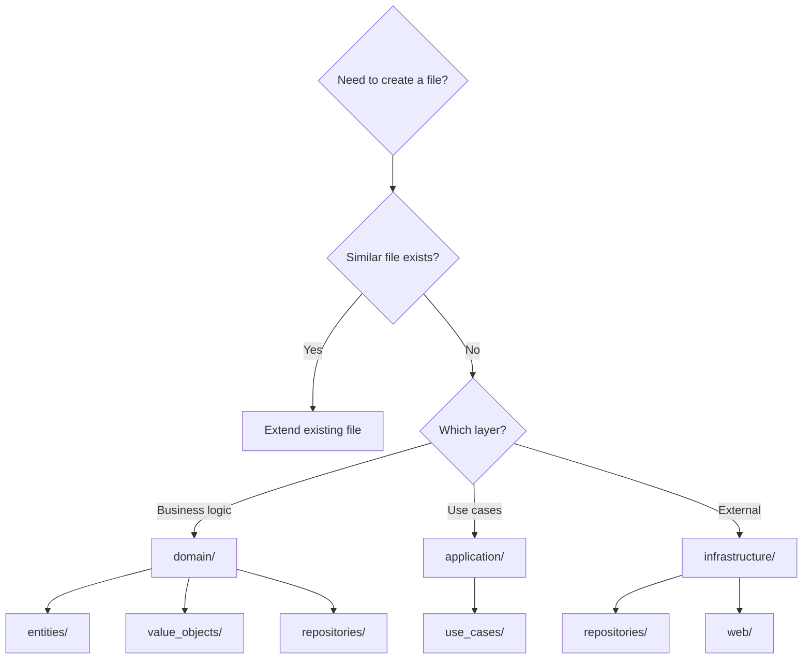

# Python Coding Standards

Reference for Codex prompts and Gemini reviews.

---

## 1. Type Hints (Python 3.13+)

### Modern Syntax Only

| Modern (Required) | Legacy (Prohibited) |
|-------------------|---------------------|
| `str \| None` | `Optional[str]` |
| `list[str]` | `List[str]` |
| `dict[str, int]` | `Dict[str, int]` |
| `type[T]` syntax | `TypeVar('T')` |

### Basic Examples

```python
# ✅ CORRECT
def process(value: str | None) -> list[str]:
    items: dict[str, int] = {}
    return []

# ❌ PROHIBITED
from typing import Optional, List, Dict
def process(value: Optional[str]) -> List[str]:
    ...
```

### Generics (Python 3.13+)

```python
# ✅ Python 3.13+ syntax
def first[T](items: list[T]) -> T | None:
    return items[0] if items else None

class Stack[T]:
    def __init__(self) -> None:
        self._items: list[T] = []

    def push(self, item: T) -> None:
        self._items.append(item)

    def pop(self) -> T | None:
        return self._items.pop() if self._items else None

# Type aliases
type UserId = str
type UserMap = dict[UserId, User]

# ❌ PROHIBITED - Legacy TypeVar
from typing import TypeVar
T = TypeVar('T')
def first(items: list[T]) -> T | None:
    ...
```

### Protocol (Structural Subtyping)

```python
from typing import Protocol

class Drawable(Protocol):
    def draw(self) -> None: ...

def render(obj: Drawable) -> None:
    obj.draw()
```

### Self Type

```python
from typing import Self

class Entity(BaseModel):
    @classmethod
    def create(cls, **kwargs) -> Self:
        return cls(**kwargs)

    def update(self, **kwargs) -> Self:
        return self.__class__(**self.model_dump() | kwargs)
```

---

## 2. Pydantic (Domain Models)

Use pydantic for entities and value objects.

### Entity

```python
from pydantic import BaseModel, Field
from typing import Self
from uuid import UUID, uuid4

class User(BaseModel):
    model_config = {"frozen": False}

    id: UUID = Field(default_factory=uuid4)
    name: str
    email: str

    @classmethod
    def create(cls, **kwargs) -> Self:
        return cls(**kwargs)
```

### Value Object (Immutable)

```python
from pydantic import BaseModel, field_validator

class Email(BaseModel):
    model_config = {"frozen": True}

    value: str

    @field_validator("value")
    @classmethod
    def validate_email(cls, v: str) -> str:
        if "@" not in v:
            raise ValueError("Invalid email")
        return v
```

---

## 3. Async Processing (Optional)

### Rules

- Async is **optional**. Sync is the default.
- When async is needed, use **anyio** (trio backend).
- Do NOT use `asyncio` directly.

### Sync (Default)

```python
def fetch_data(url: str) -> dict[str, Any]:
    import httpx
    return httpx.get(url).json()
```

### Async (When Needed)

```python
import anyio
from anyio import Path as AsyncPath

async def read_file(path: str) -> str:
    return await AsyncPath(path).read_text()

async def fetch_data(url: str) -> dict[str, Any]:
    import httpx
    async with httpx.AsyncClient() as client:
        return (await client.get(url)).json()

# Concurrent execution
async def process_urls(urls: list[str]) -> list[dict]:
    results: list[dict] = []

    async def fetch_one(url: str) -> None:
        results.append(await fetch_data(url))

    async with anyio.create_task_group() as tg:
        for url in urls:
            tg.start_soon(fetch_one, url)

    return results

# Entry point
if __name__ == "__main__":
    anyio.run(main)
```

---

## 4. File Placement Rules

### Before Creating Files

1. **Understand directory structure first**
2. **Check for existing similar files**
3. **Follow Clean Architecture layers**
4. **Never create duplicates**

### Decision Flow



### ❌ Common Mistakes

```python
# ❌ Creating utils.py when helpers.py exists
# ❌ Creating new service when existing one handles same domain
# ❌ Putting infrastructure code in domain layer
# ❌ Creating flat structure instead of layered
```

---

## 5. Docstrings (Google Style)

Only for complex functions. Skip for obvious ones.

```python
def calculate_compound_interest(
    principal: float,
    rate: float,
    periods: int,
    compounds_per_period: int = 12,
) -> float:
    """Calculate compound interest.

    Args:
        principal: Initial investment amount.
        rate: Annual interest rate as decimal (0.05 = 5%).
        periods: Number of years.
        compounds_per_period: Compounding frequency per year.

    Returns:
        Final amount after compound interest.

    Raises:
        ValueError: If rate or periods is negative.
    """
    if rate < 0 or periods < 0:
        raise ValueError("Rate and periods must be non-negative")
    n = compounds_per_period
    return principal * (1 + rate / n) ** (n * periods)
```

---

## Validation Commands

```bash
# Format & Lint
ruff format && ruff check --fix

# Type check
mypy src/ --strict

# All checks
ruff format && ruff check --fix && mypy src/ --strict
```
