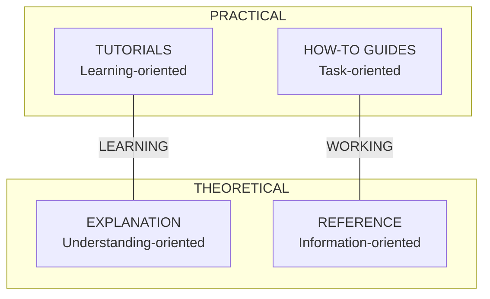

# Documentation Guide

## Overview

Documentation follows the **Diátaxis** framework with **Sphinx** and **Markdown**.

---

## Diátaxis Framework

Four types of documentation, each serving a different purpose:



### Document Types

| Type | Purpose | Audience | Example |
|------|---------|----------|---------|
| **Tutorials** | Teach beginners | New users | "Getting Started with Auth" |
| **How-to** | Solve specific tasks | Working developers | "How to Configure JWT" |
| **Reference** | Technical details | All developers | API reference, config options |
| **Explanation** | Provide context | Those seeking understanding | "Why Clean Architecture" |

---

## Directory Structure

```
docs/
├── conf.py                      # Sphinx configuration
├── index.md                     # Documentation home
├── Makefile                     # Build commands
│
├── tutorials/                   # Learning-oriented
│   ├── index.md
│   ├── getting-started.md
│   ├── first-feature.md
│   └── testing-basics.md
│
├── how-to/                      # Task-oriented
│   ├── index.md
│   ├── authentication.md
│   ├── database-setup.md
│   └── deployment.md
│
├── reference/                   # Information-oriented
│   ├── index.md
│   ├── configuration.md
│   ├── api/                     # Auto-generated by sphinx-apidoc
│   │   ├── modules.rst
│   │   └── ...
│   └── architecture.md
│
└── explanation/                 # Understanding-oriented
    ├── index.md
    ├── clean-architecture.md
    ├── design-decisions.md
    └── security-model.md
```

---

## Sphinx Configuration

### conf.py

```python
project = "ProjectName"
author = "Team"

extensions = [
    "myst_parser",           # Markdown support
    "sphinx.ext.autodoc",    # Auto-generate from docstrings
    "sphinx.ext.napoleon",   # Google-style docstrings
    "sphinx.ext.viewcode",   # Link to source code
    "sphinx_autodoc_typehints",  # Type hints in docs
]

# Markdown support
source_suffix = {
    ".rst": "restructuredtext",
    ".md": "markdown",
}

myst_enable_extensions = [
    "colon_fence",
    "deflist",
]

# Auto-doc settings
autodoc_default_options = {
    "members": True,
    "undoc-members": True,
    "show-inheritance": True,
}

# Output
html_theme = "furo"  # or "sphinx_rtd_theme"
```

### requirements-docs.txt

```
sphinx>=7.0
myst-parser>=2.0
sphinx-autodoc-typehints>=1.24
furo>=2023.9
```

---

## API Documentation (Auto-generated)

### Generate with sphinx-apidoc

```bash
# Generate API reference from source
sphinx-apidoc -o docs/reference/api src/

# Rebuild after code changes
sphinx-apidoc -f -o docs/reference/api src/
```

### Docstring Requirements

For auto-generation to work, use Google-style docstrings:

```python
def create_user(email: str, name: str) -> User:
    """Create a new user.

    Args:
        email: User's email address.
        name: User's display name.

    Returns:
        Created user entity.

    Raises:
        ValidationError: If email is invalid.
        DuplicateError: If email already exists.

    Example:
        >>> user = create_user("test@example.com", "Test")
        >>> print(user.id)
        UUID('...')
    """
```

---

## Writing Guidelines

### Tutorials

**Goal**: Help beginners learn by doing.

```markdown
# Getting Started with Authentication

In this tutorial, you'll learn how to:
- Set up user authentication
- Create your first protected endpoint
- Test the authentication flow

## Prerequisites
- Python 3.13+
- Project cloned and dependencies installed

## Step 1: Create User Entity
First, let's create a User entity...

[Step-by-step instructions with code examples]

## What You've Learned
- How to create entities
- How to implement authentication
- How to test protected endpoints

## Next Steps
- [How to Configure JWT](../how-to/jwt-configuration.md)
```

### How-to Guides

**Goal**: Help users accomplish specific tasks.

```markdown
# How to Configure JWT Authentication

This guide shows how to configure JWT settings for your application.

## Problem
You need to customize JWT token expiration and secret key.

## Solution

### Step 1: Set Environment Variables
```bash
export JWT_SECRET="your-secret-key"
export JWT_EXPIRATION=3600
```

### Step 2: Update Configuration
...

## See Also
- [Configuration Reference](../reference/configuration.md)
- [Security Model](../explanation/security-model.md)
```

### Reference

**Goal**: Provide accurate, complete technical information.

```markdown
# Configuration Reference

## Environment Variables

| Variable | Type | Default | Description |
|----------|------|---------|-------------|
| `JWT_SECRET` | string | required | Secret key for JWT signing |
| `JWT_EXPIRATION` | int | 3600 | Token expiration in seconds |
| `DATABASE_URL` | string | required | Database connection string |

## Configuration File

```yaml
# config.yaml
auth:
  jwt_secret: ${JWT_SECRET}
  expiration: 3600
```

## API Reference

See [API Documentation](api/modules.rst) for auto-generated API reference.
```

### Explanation

**Goal**: Help users understand concepts and decisions.

```markdown
# Why Clean Architecture

## Overview
This document explains why we chose Clean Architecture and how it benefits the project.

## The Problem
Traditional architectures often lead to...

## Our Solution
Clean Architecture separates concerns into layers...

## Trade-offs
### Benefits
- Testability
- Flexibility

### Costs
- Initial complexity
- More files

## Conclusion
For our use case, the benefits outweigh the costs because...
```

---

## Documentation Update Checklist

When to update docs:

| Change Type | Update |
|-------------|--------|
| New feature | tutorials/ or how-to/ |
| New API endpoint | Auto-generate with sphinx-apidoc |
| Config change | reference/configuration.md |
| Architecture change | explanation/ |
| Bug fix (user-visible) | how-to/ or reference/ |
| Internal refactor | Usually no update |

### Commit with Docs

```bash
# After code changes
sphinx-apidoc -f -o docs/reference/api src/

# Commit together
git add src/ docs/
git commit -m "feat(auth): add token refresh

Implemented automatic token refresh.

Docs: Updated how-to/authentication.md"
```

---

## Build Commands

```bash
# Install dependencies
pip install -r requirements-docs.txt

# Generate API docs
sphinx-apidoc -f -o docs/reference/api src/

# Build HTML
cd docs && make html

# View locally
open docs/_build/html/index.html

# Clean build
cd docs && make clean
```
