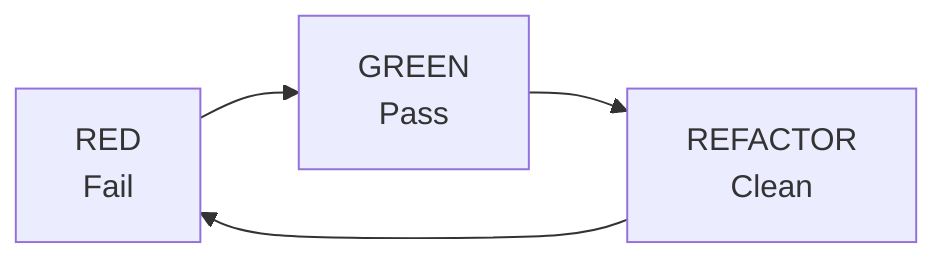

# Testing Guide

## TDD Cycle



### Rules

1. **Write tests BEFORE implementation**
2. **Tests MUST fail before implementation**
3. **Write minimal code to pass tests**
4. **Refactor while keeping tests green**
5. **All public APIs must have tests**
6. **Maintain coverage above 80%**

---

## Test Organization

```
tests/
├── conftest.py              # Shared fixtures
├── unit/                    # Unit tests (fast, isolated)
│   ├── domain/
│   │   ├── test_user.py
│   │   └── test_email.py
│   └── application/
│       └── test_create_user.py
├── integration/             # Integration tests (DB, external)
│   ├── test_user_repository.py
│   └── test_api_endpoints.py
└── e2e/                     # End-to-end tests
    └── test_user_flow.py
```

---

## Test Patterns

### AAA Pattern (Arrange/Act/Assert)

```python
def test_user_creation() -> None:
    # Arrange
    email = Email("test@example.com")
    name = "Test User"

    # Act
    user = User.create(email=email, name=name)

    # Assert
    assert user.email == email
    assert user.name == name
    assert user.is_active is True
```

### Fixture Usage

```python
# conftest.py
import pytest
from domain.value_objects.email import Email
from domain.entities.user import User

@pytest.fixture
def sample_email() -> Email:
    return Email("test@example.com")

@pytest.fixture
def sample_user(sample_email: Email) -> User:
    return User.create(email=sample_email, name="Test User")

# test_user.py
def test_user_is_active_by_default(sample_user: User) -> None:
    assert sample_user.is_active is True
```

### Parametrized Tests

```python
import pytest

@pytest.mark.parametrize("email,is_valid", [
    ("user@example.com", True),
    ("user@domain.co.jp", True),
    ("invalid", False),
    ("@example.com", False),
    ("user@", False),
    ("", False),
])
def test_email_validation(email: str, is_valid: bool) -> None:
    if is_valid:
        assert Email(email).value == email
    else:
        with pytest.raises(ValueError):
            Email(email)
```

### Exception Testing

```python
import pytest
from domain.exceptions import UserNotFoundError

def test_get_user_raises_when_not_found() -> None:
    repository = InMemoryUserRepository()
    use_case = GetUserUseCase(repository)

    with pytest.raises(UserNotFoundError) as exc_info:
        use_case.execute("nonexistent-id")

    assert "not found" in str(exc_info.value)
```

### Mock Usage

```python
from unittest.mock import Mock, patch

def test_notification_sent_on_user_creation() -> None:
    # Arrange
    repository = InMemoryUserRepository()
    notifier = Mock(spec=NotificationService)
    use_case = CreateUserUseCase(repository, notifier)

    # Act
    use_case.execute(CreateUserInput(
        email="test@example.com",
        name="Test",
    ))

    # Assert
    notifier.notify.assert_called_once()
```

---

## Test Categories

### Unit Tests

- Test single unit in isolation
- Mock all dependencies
- Fast execution (<100ms per test)

```python
# tests/unit/domain/test_email.py
def test_email_equality() -> None:
    email1 = Email("test@example.com")
    email2 = Email("test@example.com")
    assert email1 == email2

def test_email_immutability() -> None:
    email = Email("test@example.com")
    with pytest.raises(AttributeError):
        email.value = "new@example.com"  # type: ignore
```

### Integration Tests

- Test multiple components together
- Use real database (test instance)
- Slower execution acceptable

```python
# tests/integration/test_user_repository.py
@pytest.fixture
def db_session() -> Iterator[Session]:
    engine = create_engine("sqlite:///:memory:")
    Base.metadata.create_all(engine)
    session = Session(engine)
    yield session
    session.close()

def test_save_and_retrieve_user(db_session: Session) -> None:
    repository = PostgresUserRepository(db_session)
    user = User.create(
        email=Email("test@example.com"),
        name="Test",
    )

    repository.save(user)
    retrieved = repository.find_by_email(Email("test@example.com"))

    assert retrieved is not None
    assert retrieved.id == user.id
```

### E2E Tests

- Test complete user flows
- Use test client (FastAPI TestClient)
- Validate full request/response cycle

```python
# tests/e2e/test_user_flow.py
from fastapi.testclient import TestClient

def test_complete_user_registration_flow(client: TestClient) -> None:
    # Register
    response = client.post("/users", json={
        "email": "new@example.com",
        "name": "New User",
    })
    assert response.status_code == 201
    user_id = response.json()["user_id"]

    # Retrieve
    response = client.get(f"/users/{user_id}")
    assert response.status_code == 200
    assert response.json()["email"] == "new@example.com"
```

---

## pytest Configuration

### pyproject.toml

```toml
[tool.pytest.ini_options]
testpaths = ["tests"]
python_files = ["test_*.py"]
python_functions = ["test_*"]
addopts = [
    "-v",
    "--strict-markers",
    "--tb=short",
]
markers = [
    "slow: marks tests as slow",
    "integration: marks integration tests",
]

[tool.coverage.run]
source = ["src"]
branch = true

[tool.coverage.report]
exclude_lines = [
    "pragma: no cover",
    "if TYPE_CHECKING:",
    "raise NotImplementedError",
]
```

---

## Commands

```bash
# Run all tests
pytest

# Run with coverage
pytest --cov=src --cov-report=html

# Run specific test file
pytest tests/unit/test_user.py

# Run tests matching pattern
pytest -k "test_create"

# Run only unit tests
pytest tests/unit/

# Run with verbose output
pytest -v

# Stop on first failure
pytest -x

# Run slow tests
pytest -m slow
```

---

## Test Checklist

- [ ] Tests written before implementation
- [ ] All tests fail before implementation
- [ ] Tests pass after implementation
- [ ] Edge cases covered
- [ ] Error conditions tested
- [ ] Mocks used appropriately
- [ ] No test interdependencies
- [ ] Coverage > 80%
