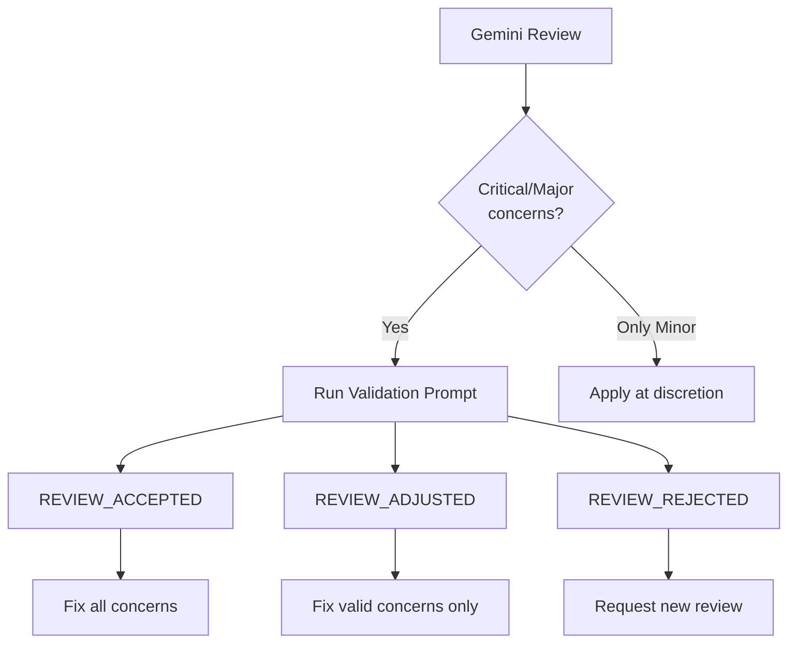

# Gemini Review Templates

## MCP Tools

- `gemini-review-file`: Single file review
- `gemini-review-files`: Multi-file review with context
- `gemini-query`: General queries

---

## Standard Review Prompt

```
Review this implementation with an extremely critical and meticulous attitude.

Evaluate against:
- Clean Architecture compliance (dependencies point inward)
- SOLID principles adherence
- Python 3.12+ type hint usage (str | None, NOT Optional)
- DRY principle
- Error handling appropriateness
- Performance considerations

Identify ALL concerns, no matter how minor.
```

---

## Phase-Specific Templates

### Phase 1: Analysis Review

```
Analyze this codebase investigation.

Evaluate:
- Completeness of analysis
- Accuracy of pattern identification
- Missed architectural concerns
- Suggested approach viability

Provide:
1. Strengths of current codebase
2. Concerns to address
3. Recommendations for implementation
```

### Phase 2: Design Review

```
Review this design with an extremely critical attitude.

Evaluate:
- Domain layer purity (no framework dependencies)
- Interface segregation
- Value object immutability
- Repository interface completeness
- Type hint correctness (Python 3.12+)

Identify:
1. Design flaws
2. Missing abstractions
3. Potential extensibility issues
```

### Phase 3: Implementation Review

```
Review this implementation with an extremely critical and meticulous attitude.

Evaluate against:
- Clean Architecture compliance
- SOLID principles adherence
- Python 3.12+ type hints (str | None, NOT Optional)
- TDD compliance (tests exist and pass)
- DRY principle
- Error handling
- Performance considerations
- Security concerns

Identify ALL concerns, no matter how minor.
Format: List each concern with severity (Critical/Major/Minor).
```

### Test Review

```
Review these tests critically.

Evaluate:
- Test coverage completeness
- Edge case handling
- Test isolation
- AAA pattern compliance
- Assertion quality
- Mock usage appropriateness

Identify:
1. Missing test cases
2. Weak assertions
3. Test coupling issues
```

---

## Response Format Request

Add this to get structured responses:

```
Format your response as:

## Summary
[One-line assessment: APPROVED / NEEDS_REVISION]

## Concerns
- [Critical] ...
- [Major] ...
- [Minor] ...

## Recommendations
1. ...
2. ...
```

---

## Review Validation

After receiving Gemini's review, validate the review itself.

### Validation Prompt

```
Evaluate the validity of the following code review.

## Code Under Review
[Paste the code]

## Review Result
[Paste Gemini's review]

## Validation Criteria

For each concern raised, evaluate:

1. **Accuracy**: Is the concern technically correct?
   - Does the issue actually exist in the code?
   - Is the technical reasoning sound?

2. **Relevance**: Is the concern relevant to this context?
   - Does it apply to the actual requirements?
   - Is it appropriate for the project scope?

3. **Severity**: Is the severity rating appropriate?
   - Critical: Would cause system failure or security breach
   - Major: Violates architecture/principles, hard to fix later
   - Minor: Style, optimization, nice-to-have

4. **Missed Issues**: Are there concerns NOT raised that should be?
   - Security vulnerabilities
   - Obvious bugs
   - Clear architecture violations

## Response Format

For each concern:
- [VALID] Concern is accurate and appropriately rated
- [INVALID] Concern is incorrect or irrelevant - explain why
- [SEVERITY_ADJUST] Correct concern but wrong severity - suggest new level

Missed issues (if any):
- [MISSED] Description of overlooked concern

Final verdict:
- REVIEW_ACCEPTED: Review is valid, proceed with fixes
- REVIEW_ADJUSTED: Some concerns invalid/adjusted, use corrected list
- REVIEW_REJECTED: Review has fundamental errors, re-review needed
```

### When to Validate

- **Always validate** Critical concerns before acting
- **Validate** when concerns seem overly strict or incorrect
- **Skip validation** for Minor concerns (optional fixes)

### Validation Flow



---

## Iteration Pattern

When concerns are found:

```
The following concerns were raised in the previous review:
[List concerns]

Verify that ALL concerns have been addressed.
If any remain unresolved, list them again.
If all resolved, respond with "No concerns."
```
