# Git Workflow

## Branch Strategy

### Branch Types

| Type | Pattern | Purpose | Lifetime |
|------|---------|---------|----------|
| `main` | `main` | Production-ready code | Permanent |
| `develop` | `develop` | Integration branch | Permanent |
| `feature` | `feature/<ticket>-<description>` | New features | Until merged |
| `fix` | `fix/<ticket>-<description>` | Bug fixes | Until merged |
| `refactor` | `refactor/<description>` | Code improvements | Until merged |
| `docs` | `docs/<description>` | Documentation only | Until merged |

### Branch Naming

```
feature/123-user-authentication
fix/456-login-timeout
refactor/extract-validation-logic
docs/api-reference-update
```

### Branch Flow


---

## Commit Strategy

### Commit Granularity

Each commit should be:
- **Atomic**: One logical change
- **Complete**: Tests pass, code compiles
- **Documented**: Includes doc updates if needed

### Commit Types (Conventional Commits)

| Type | Description | Triggers Doc Update? |
|------|-------------|---------------------|
| `feat` | New feature | Yes - tutorials/how-to |
| `fix` | Bug fix | Maybe - if behavior changes |
| `refactor` | Code restructure | No |
| `test` | Add/update tests | No |
| `docs` | Documentation only | N/A |
| `perf` | Performance improvement | Maybe - reference |
| `chore` | Maintenance | No |

### Commit Message Format

```
<type>(<scope>): <description>

[body]

[footer]
```

### Examples

```bash
# Feature with docs
feat(auth): add JWT token refresh

Implement automatic token refresh before expiration.
Token refresh threshold is configurable via settings.

Docs: Added how-to guide for token configuration.

# Bug fix
fix(api): handle timeout in user service

Increase default timeout to 30s and add retry logic.

Fixes #456

# Refactor (no docs needed)
refactor(validation): extract to separate module

Move validation logic from UserService to ValidationService.
No behavior changes.
```

---

## Commit Checklist

Before each commit:

- [ ] Code changes complete
- [ ] Tests pass locally
- [ ] Type check passes (mypy)
- [ ] Lint passes (ruff)
- [ ] Documentation updated (if applicable)
  - [ ] API changes → Update reference docs
  - [ ] New feature → Add tutorial or how-to
  - [ ] Config changes → Update reference
  - [ ] Behavior changes → Update explanation

### Documentation Decision Tree


---

## Pull Request Strategy

### PR Scope

One PR should contain:
- **One feature** or **one fix**
- Related tests
- Related documentation updates
- Max 400 lines changed (excluding auto-generated)

### PR Naming

```
feat(auth): implement user authentication (#123)
fix(api): resolve timeout issue (#456)
docs: add authentication tutorial
refactor: extract validation module
```

### PR Template

```markdown
## Summary
[Brief description of changes]

## Type
- [ ] Feature
- [ ] Bug fix
- [ ] Refactor
- [ ] Documentation

## Changes
- [Change 1]
- [Change 2]

## Documentation
- [ ] No docs needed
- [ ] Docs updated: [list files]
- [ ] API docs auto-generated

## Testing
- [ ] Unit tests added/updated
- [ ] Integration tests added/updated
- [ ] All tests pass

## Checklist
- [ ] Code follows project standards
- [ ] Self-reviewed
- [ ] Gemini review passed
- [ ] Documentation complete
```

### PR Flow


---

## Workflow Integration

### Phase 3 with Git

```mermaid
graph TD
    subgraph Step1[Step 1: Create Branch]
        A1[git checkout -b feature/123-description]
    end

    subgraph Step2[Step 2: TDD Cycle]
        B1[Write tests] --> B2[commit: test: add X tests]
        B2 --> B3[Implement] --> B4[commit: feat: implement X]
        B4 --> B5[Refactor] --> B6[commit: refactor: clean up X]
    end

    subgraph Step3[Step 3: Documentation]
        C1[Update docs] --> C2[commit: docs: add X to reference]
    end

    subgraph Step4[Step 4: Push & PR]
        D1[git push -u origin feature/123-description]
    end

    subgraph Step5[Step 5: Review Cycle]
        E1[Gemini review] --> E2[Gemini validate]
        E2 --> E3{Issues?}
        E3 -->|Yes| E4[Fix] --> E5[commit: fix: address review]
        E5 --> E1
        E3 -->|No| E6[Done]
    end

    subgraph Step6[Step 6: Merge]
        F1[Squash merge to develop] --> F2[Delete branch]
    end

    Step1 --> Step2 --> Step3 --> Step4 --> Step5 --> Step6
```



### Commit Frequency Guidelines

| Change Type | Commit After |
|-------------|--------------|
| Test file created | Each test file |
| Implementation complete | Each module/class |
| Refactoring done | Each logical improvement |
| Docs updated | Each doc file |
| Bug fixed | Each fix |
