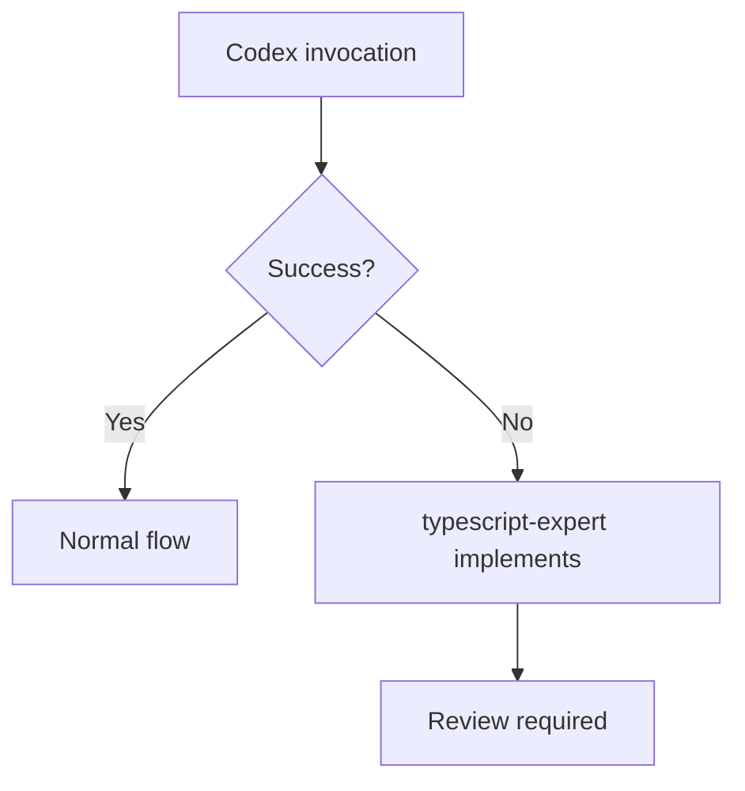

# TypeScript Development Skill

## Contents

| Directory | Description |
|-----------|-------------|
| workflow/ | Workflow details, prompt templates, git workflow |
| guides/ | Coding standards, architecture, testing, documentation |
| examples/ | Step-by-step implementation examples |
| templates/ | Code templates (components, hooks, stores, forms, animations) |
| scripts/ | Validation scripts |
| checklists/ | Phase checklists |

## Shared Patterns

See `~/.claude/skills/dev-workflow-core/SKILL.md`

---

## Workflow Integration

### Track Selection

| Scenario | Track | Example |
|----------|-------|---------|
| New feature/page | /feat | "Add user dashboard page" |
| Component fix, style tweak | /patch | "Fix button hover state" |
| Code understanding | /explore | "How does the auth context work?" |

### /feat for TypeScript

```
/feat "Add user settings page"

1. Intent verification
2. spec.md (requirements, user stories)
3. plan.md (component architecture)
4. tasks.md (ordered implementation)
5. TDD implementation + Storybook
6. PR
```

### /patch for TypeScript

```
/patch "Fix loading state in UserCard"

1. Scope check (≤2 files)
2. typescript-expert implements
3. Tests pass
4. Claude subagent review
5. Commit
```

---

## Prime Directives

### 1. Role Assignment

| Agent | /feat | /patch |
|-------|-------|--------|
| **Claude** | Orchestration | Coordination |
| **Codex** | Complex (3+ files) | — |
| **typescript-expert** | Simple (1-2 files) | Implementation |
| **Gemini** | Full review | — |
| **Claude Subagent** | — | Light review |

### 2. Claude Direct Execution

The following do NOT require Codex:
- Git operations (commit, push, PR)
- File creation/deletion
- Minor fixes (1-2 lines)
- /patch implementations

### 3. Codex Fallback



### 4. Complete Resolution Principle

Iterate until reviewer returns "APPROVED". Never settle for partial fixes.

---

## Coding Standards (Summary)

See `guides/coding-standards.md` for full details.

### TypeScript Strict Mode

```typescript
// ✅ Strict types
function getUser(id: string): User | null { ... }

// ❌ No any
function getUser(id: any): any { ... }
```

### File Naming

- Routes/Dirs: kebab-case (app/user-settings/)
- Components: PascalCase (UserCard.tsx)
- Hooks/Utils: kebab-case (use-user.ts)

---

## Tech Stack

See `guides/libraries.md` for detailed usage.

| Category | Library | Purpose |
|----------|---------|---------|
| Framework | Next.js 14+ | App Router, RSC |
| State (Global) | Zustand | Client state |
| State (Server) | TanStack Query | Server state, caching |
| Validation | Zod | Runtime schema |
| UI | shadcn/ui | Base components |
| Forms | React Hook Form | Form management |
| Animation | Framer Motion | Animations |
| Test | Vitest + Playwright | Unit + E2E |

---

## Validation Commands

```bash
# Lint
npm run lint

# Type check
npx tsc --noEmit

# Test (unit)
npm run test

# Test (E2E)
npx playwright test

# Build
npm run build
```
