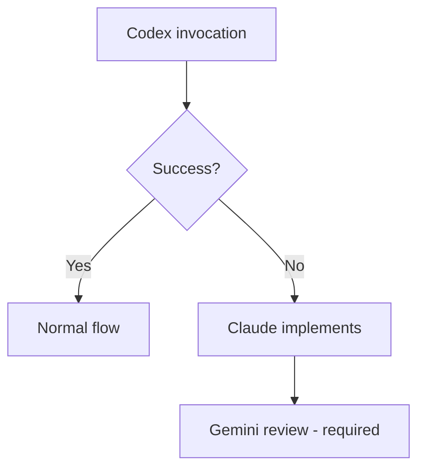
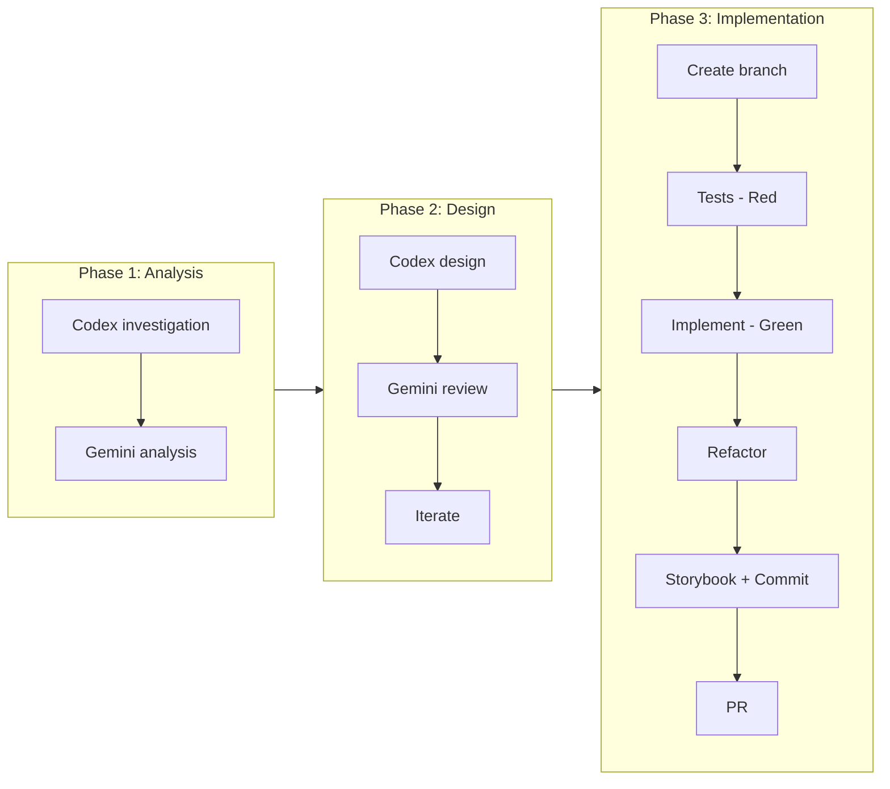

# TypeScript Development Skill

## Contents

| Directory | Description |
|-----------|-------------|
| `workflow/` | Workflow details, prompt templates, git workflow |
| `guides/` | Coding standards, architecture, testing, documentation |
| `examples/` | Step-by-step implementation examples |
| `templates/` | Code templates (components, hooks, stores, forms, animations) |
| `scripts/` | Validation scripts |
| `checklists/` | Phase checklists |

**Shared Patterns**: See `dev-workflow-core` for 3-agent workflow, iteration control, review validation.

---

## Prime Directives

### 1. Role Assignment

| Agent | Normal | Codex Unavailable |
|-------|--------|-------------------|
| **Claude** | Orchestration, decisions | Decisions + implementation |
| **Codex** | Code implementation | — |
| **Gemini** | Review, quality assessment | Review (required) |

### 2. Claude Direct Execution

The following do NOT require Codex:
- Git operations (commit, push, PR)
- File creation/deletion
- Minor fixes (1-2 lines)
- Implementation during Codex rate limits

### 3. Codex Fallback



### 4. Complete Resolution Principle

Iterate until Gemini returns "no concerns". Never settle for partial fixes.
See `dev-workflow-core/workflow/iteration-control.md` for loop prevention.

---

## Quick Start

### Basic Flow



- Git: `workflow/git-workflow.md`
- Docs: `guides/documentation.md`
- Details: `workflow/overview.md`

---

## Coding Standards (Summary)

See `guides/coding-standards.md` for details.

### TypeScript Strict Mode

```typescript
// ✅ Strict types
function getUser(id: string): User | null { ... }

// ❌ No any
function getUser(id: any): any { ... }
```

### File Naming

```
Routes/Dirs:     kebab-case   (app/user-settings/)
Components:      PascalCase   (UserCard.tsx)
Hooks/Utils:     kebab-case   (use-user.ts)
```

---

## Tech Stack

See `guides/libraries.md` for detailed usage.

| Category | Library | Purpose |
|----------|---------|---------|
| Framework | Next.js 14+ | App Router, RSC |
| State (Global) | Zustand | Client state |
| State (Server) | TanStack Query | Server state, caching |
| Validation | Zod | Runtime schema |
| UI | shadcn/ui | Base components |
| Forms | React Hook Form | Form management |
| Animation | Framer Motion | Animations |
| Date | date-fns | Date manipulation |
| Toast | Sonner | Notifications |
| Test | Vitest + Playwright | Unit + E2E |

---

## Validation Commands

```bash
# Lint
npm run lint

# Type check
npx tsc --noEmit

# Test (unit)
npm run test

# Test (E2E)
npx playwright test

# Build
npm run build

# Storybook
npm run storybook
```
