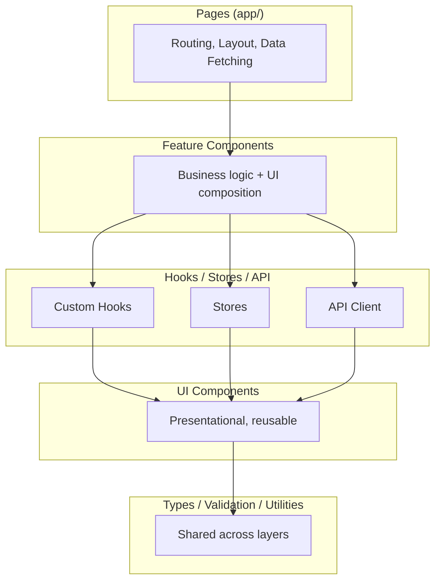

# Frontend Architecture Guide

## Overview

Frontend uses **Feature-based Architecture**, unlike backend Clean Architecture.



---

## Directory Structure

```
project-root/
├── app/                           # Next.js App Router
│   ├── (auth)/                    # Route group
│   │   ├── login/page.tsx
│   │   └── layout.tsx
│   ├── (dashboard)/
│   │   ├── overview/page.tsx
│   │   ├── settings/page.tsx
│   │   └── layout.tsx
│   ├── api/                       # API routes
│   ├── globals.css
│   ├── layout.tsx                 # Root layout
│   └── page.tsx
│
├── components/
│   ├── ui/                        # Base primitives (shadcn/ui)
│   │   ├── button.tsx
│   │   ├── card.tsx
│   │   └── dialog.tsx
│   ├── layout/                    # Shared layout components
│   │   ├── PageContainer.tsx
│   │   ├── PageHeader.tsx
│   │   ├── Header.tsx
│   │   └── Sidebar.tsx
│   └── features/                  # Feature-specific components
│       ├── user/
│       │   ├── UserCard.tsx
│       │   ├── UserList.tsx
│       │   └── UserForm.tsx
│       └── dashboard/
│           └── StatsCard.tsx
│
├── lib/
│   ├── api/                       # API client
│   │   ├── client.ts
│   │   └── endpoints/
│   ├── hooks/                     # Custom hooks
│   │   ├── use-user.ts
│   │   └── use-auth.ts
│   ├── stores/                    # Zustand stores
│   │   ├── user-store.ts
│   │   └── ui-store.ts
│   ├── types/                     # Type definitions
│   │   └── user.ts
│   ├── utils/                     # Utilities
│   │   ├── cn.ts
│   │   └── format-date.ts
│   └── validation/                # Zod schemas
│       └── user-schema.ts
│
├── stories/                       # Storybook stories
│   ├── UserCard.stories.tsx
│   └── Button.stories.tsx
│
└── tests/
    ├── components/
    └── hooks/
```

---

## Layer Responsibilities

### Pages (app/)

- **Routing and layouts**
- **Server-side data fetching** (Server Components)
- **Metadata** (SEO)
- **Compose feature components**

```typescript
// app/users/page.tsx
import { PageContainer } from "@/components/layout/PageContainer";
import { PageHeader } from "@/components/layout/PageHeader";
import { UserList } from "@/components/features/user/UserList";

export default function UsersPage() {
  return (
    <PageContainer>
      <PageHeader title="Users" description="Manage users" />
      <UserList />
    </PageContainer>
  );
}
```

### Feature Components (components/features/)

- **Business logic**
- **Combine UI components**
- **Use custom hooks** for state/logic
- **Feature-specific styling**

```typescript
// components/features/user/UserList.tsx
"use client";

import { useUsers } from "@/lib/hooks/use-users";
import { UserCard } from "./UserCard";

export function UserList() {
  const { users, isLoading, error } = useUsers();

  if (isLoading) return <UserListSkeleton />;
  if (error) return <UserListError error={error} />;

  return (
    <div className="space-y-4">
      {users.map((user) => (
        <UserCard key={user.id} user={user} />
      ))}
    </div>
  );
}
```

### Custom Hooks (lib/hooks/)

- **Extract reusable logic** from components
- **Manage local state**
- **Handle side effects**
- **Connect to stores/API**

```typescript
// lib/hooks/use-users.ts
export function useUsers() {
  const query = useQuery({
    queryKey: ["users"],
    queryFn: fetchUsers,
  });

  return {
    users: query.data ?? [],
    isLoading: query.isLoading,
    error: query.error,
  };
}
```

### Stores (lib/stores/)

- **Global application state**
- **Cross-component communication**
- **Persist state if needed**

```typescript
// lib/stores/user-store.ts
import { create } from "zustand";
import { persist } from "zustand/middleware";

interface UserState {
  user: User | null;
  setUser: (user: User) => void;
  clearUser: () => void;
}

export const useUserStore = create<UserState>()(
  persist(
    (set) => ({
      user: null,
      setUser: (user) => set({ user }),
      clearUser: () => set({ user: null }),
    }),
    { name: "user-storage" }
  )
);
```

### UI Components (components/ui/)

- **Pure presentational**
- **No business logic**
- **Accept props** for customization
- **Accessible by default**

```typescript
// components/ui/card.tsx (shadcn/ui)
import { cn } from "@/lib/utils/cn";

interface CardProps {
  children: React.ReactNode;
  className?: string;
}

export function Card({ children, className }: CardProps) {
  return (
    <div className={cn("rounded-lg border bg-card p-6", className)}>
      {children}
    </div>
  );
}
```

---

## Design Consistency

### Shared Layout Components (REQUIRED)

Every page MUST use shared layout components.

```typescript
// components/layout/PageContainer.tsx
interface PageContainerProps {
  children: React.ReactNode;
  className?: string;
  maxWidth?: "sm" | "md" | "lg" | "xl" | "2xl" | "full";
}

export function PageContainer({
  children,
  className,
  maxWidth = "2xl",
}: PageContainerProps) {
  return (
    <div
      className={cn(
        "mx-auto w-full px-4 py-6 sm:px-6 lg:px-8",
        maxWidth !== "full" && `max-w-${maxWidth}`,
        className
      )}
    >
      {children}
    </div>
  );
}

// components/layout/PageHeader.tsx
interface PageHeaderProps {
  title: string;
  description?: string;
  actions?: React.ReactNode;
}

export function PageHeader({ title, description, actions }: PageHeaderProps) {
  return (
    <div className="mb-8 flex items-center justify-between">
      <div>
        <h1 className="text-2xl font-bold tracking-tight">{title}</h1>
        {description && (
          <p className="mt-1 text-muted-foreground">{description}</p>
        )}
      </div>
      {actions && <div className="flex items-center gap-2">{actions}</div>}
    </div>
  );
}
```

### Consistent Spacing

| Usage | Class | Value |
|-------|-------|-------|
| Page padding | `p-6` | 24px |
| Section gap | `space-y-8` | 32px |
| Card padding | `p-6` | 24px |
| Item gap | `gap-4` | 16px |
| Inline gap | `gap-2` | 8px |

### Typography Scale

```typescript
<h1 className="text-2xl font-bold tracking-tight">Page Title</h1>
<h2 className="text-xl font-semibold">Section Title</h2>
<h3 className="text-lg font-medium">Subsection Title</h3>
<p className="text-muted-foreground">Description text</p>
<span className="text-sm text-muted-foreground">Small/meta text</span>
```

---

## Component Patterns

### Container/Presentational Split

```typescript
// Container (with logic)
export function UserList() {
  const { users, isLoading } = useUsers();
  if (isLoading) return <Skeleton />;
  return <UserListView users={users} />;
}

// Presentational (pure)
interface UserListViewProps {
  users: User[];
}

export function UserListView({ users }: UserListViewProps) {
  return (
    <div className="space-y-4">
      {users.map((user) => (
        <UserCard key={user.id} user={user} />
      ))}
    </div>
  );
}
```

### Composition Pattern

```typescript
// Compound component pattern
<Card>
  <Card.Header>
    <Card.Title>Title</Card.Title>
  </Card.Header>
  <Card.Content>Content</Card.Content>
  <Card.Footer>Footer</Card.Footer>
</Card>
```
