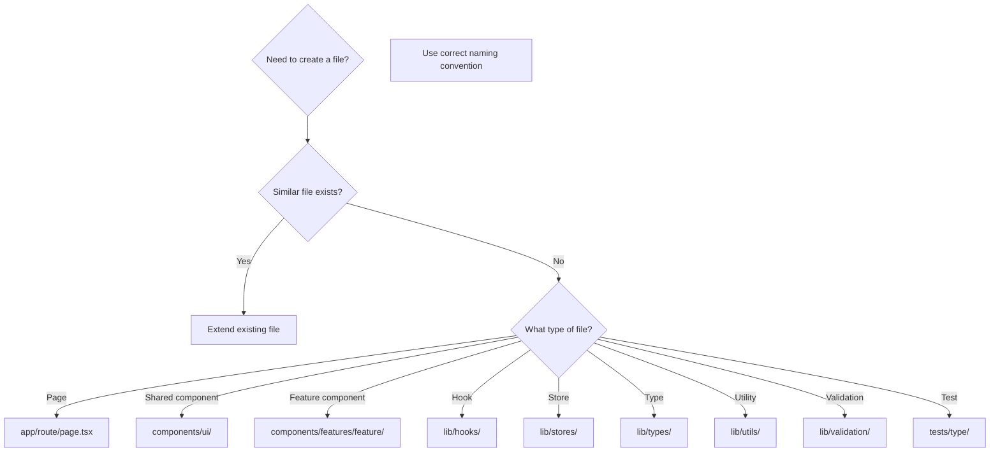

# TypeScript Coding Standards

Reference for Codex prompts and Gemini reviews.

---

## 1. TypeScript Strict Mode

### Required: No `any`

```typescript
// ✅ CORRECT
function getUser(id: string): User | null {
  return users.find(u => u.id === id) ?? null;
}

interface ApiResponse<T> {
  data: T;
  error: string | null;
}

// ❌ PROHIBITED
function getUser(id: any): any {
  return users.find(u => u.id === id);
}
```

### Explicit Return Types

```typescript
// ✅ CORRECT - explicit return type
function calculateTotal(items: CartItem[]): number {
  return items.reduce((sum, item) => sum + item.price, 0);
}

// ✅ CORRECT - complex return type
function useUser(id: string): {
  user: User | null;
  isLoading: boolean;
  error: Error | null;
} {
  // ...
}
```

### Type Inference Guidelines

```typescript
// ✅ Let TypeScript infer when obvious
const count = 0;  // inferred as number
const name = "Alice";  // inferred as string

// ✅ Explicit type when needed
const items: CartItem[] = [];  // empty array needs type
const config: Config = { ... };  // complex object

// ✅ Always explicit for function parameters and returns
function process(data: InputData): OutputData { ... }
```

---

## 2. File Naming Conventions

### kebab-case (Default)

| Element | Convention | Example |
|---------|------------|---------|
| Route directories | `kebab-case` | `app/user-settings/` |
| Route groups | `(kebab-case)` | `app/(auth)/login/` |
| API routes | `kebab-case` | `app/api/user-profile/` |
| Utility files | `kebab-case` | `lib/utils/format-date.ts` |
| Hook files | `kebab-case` | `lib/hooks/use-user.ts` |
| Type files | `kebab-case` | `lib/types/user-types.ts` |
| Store files | `kebab-case` | `lib/stores/user-store.ts` |
| Test files | `kebab-case` | `tests/components/user-card.test.tsx` |

### PascalCase (Components Only)

| Element | Convention | Example |
|---------|------------|---------|
| Component files | `PascalCase` | `UserCard.tsx` |
| Component folders | `PascalCase` | `components/features/User/` |

### Examples

```
✅ CORRECT
app/user-settings/page.tsx
components/features/user/UserCard.tsx
lib/hooks/use-user-data.ts
lib/stores/auth-store.ts

❌ INCORRECT
app/userSettings/page.tsx
components/features/user/user-card.tsx
lib/hooks/useUserData.ts
```

---

## 3. Component Patterns

### Props Interface

```typescript
// ✅ CORRECT - interface with descriptive names
interface UserCardProps {
  user: User;
  onSelect?: (id: string) => void;
  className?: string;
}

export function UserCard({ user, onSelect, className }: UserCardProps) {
  return (
    <Card className={cn("p-4", className)} onClick={() => onSelect?.(user.id)}>
      {/* ... */}
    </Card>
  );
}
```

### Children Pattern

```typescript
// ✅ CORRECT - React.ReactNode for children
interface ContainerProps {
  children: React.ReactNode;
  className?: string;
}

export function Container({ children, className }: ContainerProps) {
  return <div className={cn("container mx-auto", className)}>{children}</div>;
}
```

### Event Handler Types

```typescript
// ✅ CORRECT - specific event types
interface FormProps {
  onSubmit: (data: FormData) => void;
  onChange: (e: React.ChangeEvent<HTMLInputElement>) => void;
  onClick: (e: React.MouseEvent<HTMLButtonElement>) => void;
}
```

---

## 4. Hook Patterns

### Custom Hook Structure

```typescript
// ✅ CORRECT - typed return object
export function useUsers() {
  const query = useQuery({
    queryKey: ["users"],
    queryFn: fetchUsers,
  });

  return {
    users: query.data ?? [],
    isLoading: query.isLoading,
    error: query.error,
    refetch: query.refetch,
  } as const;
}
```

### Mutation Hook

```typescript
// ✅ CORRECT - with invalidation
export function useCreateUser() {
  const queryClient = useQueryClient();

  return useMutation({
    mutationFn: (data: CreateUserInput) => createUser(data),
    onSuccess: () => {
      queryClient.invalidateQueries({ queryKey: ["users"] });
    },
  });
}
```

---

## 5. Zod Validation

```typescript
import { z } from "zod";

// ✅ Schema definition
export const userSchema = z.object({
  email: z.string().email("Invalid email"),
  name: z.string().min(1, "Name required"),
  age: z.number().min(0).optional(),
});

// ✅ Infer type from schema
export type UserInput = z.infer<typeof userSchema>;

// ✅ Usage in form
const result = userSchema.safeParse(formData);
if (!result.success) {
  return { errors: result.error.flatten().fieldErrors };
}
```

---

## 6. File Placement Rules

### Before Creating Files

1. **Understand directory structure first**
2. **Check for existing similar files**
3. **Follow Feature-based Architecture**
4. **Never create duplicates**

### Decision Flow



---

## Validation Commands

```bash
# Type check
npx tsc --noEmit

# Lint
npm run lint

# Lint with fix
npm run lint -- --fix

# All checks
npx tsc --noEmit && npm run lint
```
