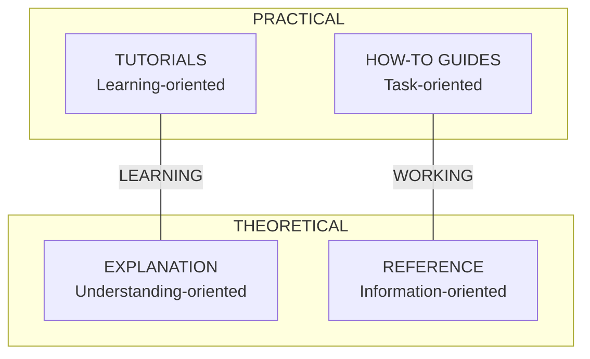

# Documentation Guide

## Overview

Documentation uses **Storybook** for components and **TypeDoc** for API reference, following the **Diátaxis** framework.

---

## Diátaxis Framework



### Document Types

| Type | Purpose | Tool |
|------|---------|------|
| **Tutorials** | Teach beginners | Markdown in docs/ |
| **How-to** | Solve specific tasks | Markdown in docs/ |
| **Reference** | Technical details | TypeDoc + Storybook |
| **Explanation** | Provide context | Markdown in docs/ |

---

## Directory Structure

```
docs/
├── tutorials/                   # Learning-oriented
│   ├── getting-started.md
│   └── first-component.md
│
├── how-to/                      # Task-oriented
│   ├── create-form.md
│   ├── add-authentication.md
│   └── use-storybook.md
│
├── reference/                   # Information-oriented
│   └── api/                     # Auto-generated by TypeDoc
│
└── explanation/                 # Understanding-oriented
    ├── architecture.md
    └── design-decisions.md

stories/                         # Storybook (component reference)
├── components/
│   ├── UserCard.stories.tsx
│   └── Button.stories.tsx
└── pages/
    └── Dashboard.stories.tsx
```

---

## Storybook

### Setup

```bash
npx storybook@latest init
```

### Story Format (CSF3)

```typescript
// stories/UserCard.stories.tsx
import type { Meta, StoryObj } from "@storybook/react";
import { UserCard } from "@/components/features/user/UserCard";

const meta: Meta<typeof UserCard> = {
  title: "Features/User/UserCard",
  component: UserCard,
  tags: ["autodocs"],
  argTypes: {
    onSelect: { action: "selected" },
  },
};

export default meta;
type Story = StoryObj<typeof UserCard>;

export const Default: Story = {
  args: {
    user: {
      id: "1",
      name: "John Doe",
      email: "john@example.com",
    },
  },
};

export const WithLongName: Story = {
  args: {
    user: {
      id: "2",
      name: "Very Long Name That Might Overflow",
      email: "longname@example.com",
    },
  },
};

export const Loading: Story = {
  render: () => <UserCardSkeleton />,
};
```

### Story Organization

```
stories/
├── components/
│   ├── ui/                      # Base components
│   │   ├── Button.stories.tsx
│   │   └── Card.stories.tsx
│   ├── layout/                  # Layout components
│   │   ├── PageContainer.stories.tsx
│   │   └── PageHeader.stories.tsx
│   └── features/                # Feature components
│       └── user/
│           ├── UserCard.stories.tsx
│           └── UserForm.stories.tsx
└── pages/                       # Full page stories
    └── Dashboard.stories.tsx
```

### MDX Documentation

```mdx
{/* stories/UserCard.mdx */}
import { Meta, Story, Canvas, Controls } from "@storybook/blocks";
import * as UserCardStories from "./UserCard.stories";

<Meta of={UserCardStories} />

# UserCard

The UserCard component displays user information in a card format.

## Usage

<Canvas of={UserCardStories.Default} />

## Props

<Controls />

## Guidelines

- Always provide a valid user object
- Use `onSelect` for clickable cards
- Consider loading state with `UserCardSkeleton`
```

---

## TypeDoc

### Setup

```bash
npm install -D typedoc typedoc-plugin-markdown
```

### Configuration

```json
// typedoc.json
{
  "entryPoints": ["./lib"],
  "out": "./docs/reference/api",
  "plugin": ["typedoc-plugin-markdown"],
  "exclude": ["**/*.test.ts", "**/*.stories.tsx"],
  "excludePrivate": true
}
```

### TSDoc Comments

```typescript
/**
 * Fetches a user by ID.
 *
 * @param id - The user's unique identifier
 * @returns The user object or null if not found
 * @throws {ApiError} If the API request fails
 *
 * @example
 * ```ts
 * const user = await getUser("123");
 * if (user) {
 *   console.log(user.name);
 * }
 * ```
 */
export async function getUser(id: string): Promise<User | null> {
  // ...
}
```

---

## Documentation Update Rules

### When to Update

| Change Type | Update |
|-------------|--------|
| New component | Add Storybook story |
| Component API change | Update story args/docs |
| New hook/utility | Add TSDoc comments |
| New feature | Add tutorial or how-to |
| Architecture change | Update explanation/ |
| Config change | Update reference/ |

### Commit with Docs

```bash
# After component changes
git add components/ stories/
git commit -m "feat(user): add UserCard component

Added UserCard with avatar, name, and email display.

Docs: Added Storybook story for UserCard."
```

---

## Build Commands

```bash
# Build Storybook
npm run build-storybook

# Generate TypeDoc
npx typedoc

# Run Storybook dev
npm run storybook

# Test Storybook (visual regression)
npm run test-storybook
```

---

## Writing Guidelines

### Tutorials

```markdown
# Getting Started with Forms

In this tutorial, you'll learn how to:
- Create a form component
- Add validation with Zod
- Handle submission

## Prerequisites
- Node.js 18+
- Project cloned

## Step 1: Create Form Component
...
```

### How-to Guides

```markdown
# How to Add Authentication

This guide shows how to add authentication to your app.

## Problem
You need to protect routes and manage user sessions.

## Solution

### Step 1: Install Dependencies
```bash
npm install next-auth
```

### Step 2: Configure Provider
...
```

### Storybook Stories

- Include all prop variants
- Show loading/error states
- Add accessibility information
- Include usage examples in MDX
