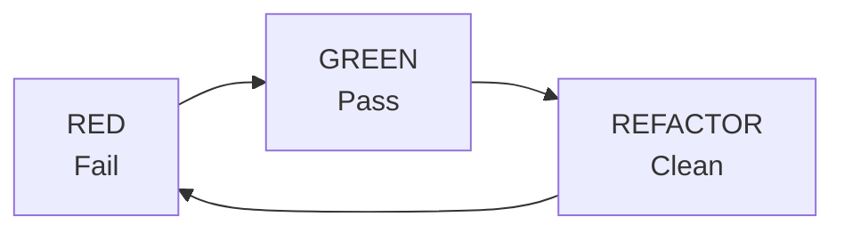

# Testing Guide

## TDD Cycle



### Rules

1. **Write tests BEFORE implementation**
2. **Tests MUST fail before implementation**
3. **Write minimal code to pass tests**
4. **Refactor while keeping tests green**
5. **All public APIs must have tests**
6. **Maintain coverage above 80%**

---

## Test Organization

```
tests/
├── components/
│   ├── user-card.test.tsx
│   └── user-form.test.tsx
├── hooks/
│   ├── use-user.test.ts
│   └── use-auth.test.ts
├── utils/
│   └── format-date.test.ts
└── setup.ts                    # Test setup (mocks, etc.)
```

---

## Testing Library Patterns

### Component Testing

```typescript
import { render, screen, fireEvent } from "@testing-library/react";
import { describe, it, expect, vi } from "vitest";
import { UserCard } from "@/components/features/user/UserCard";

describe("UserCard", () => {
  const mockUser = {
    id: "1",
    name: "Test User",
    email: "test@example.com",
  };

  it("should display user name and email", () => {
    // Arrange
    render(<UserCard user={mockUser} />);

    // Assert
    expect(screen.getByText("Test User")).toBeInTheDocument();
    expect(screen.getByText("test@example.com")).toBeInTheDocument();
  });

  it("should call onSelect when clicked", () => {
    // Arrange
    const onSelect = vi.fn();
    render(<UserCard user={mockUser} onSelect={onSelect} />);

    // Act
    fireEvent.click(screen.getByRole("article"));

    // Assert
    expect(onSelect).toHaveBeenCalledWith("1");
  });
});
```

### Async Component Testing

```typescript
import { render, screen, waitFor } from "@testing-library/react";
import { QueryClient, QueryClientProvider } from "@tanstack/react-query";

const createWrapper = () => {
  const queryClient = new QueryClient({
    defaultOptions: { queries: { retry: false } },
  });
  return ({ children }: { children: React.ReactNode }) => (
    <QueryClientProvider client={queryClient}>{children}</QueryClientProvider>
  );
};

describe("UserList", () => {
  it("should show loading state", () => {
    render(<UserList />, { wrapper: createWrapper() });
    expect(screen.getByRole("status")).toBeInTheDocument();
  });

  it("should display users after loading", async () => {
    render(<UserList />, { wrapper: createWrapper() });

    await waitFor(() => {
      expect(screen.getByText("Test User")).toBeInTheDocument();
    });
  });
});
```

### Hook Testing

```typescript
import { renderHook, waitFor } from "@testing-library/react";
import { useUsers } from "@/lib/hooks/use-users";

describe("useUsers", () => {
  it("should fetch users", async () => {
    const { result } = renderHook(() => useUsers(), {
      wrapper: createWrapper(),
    });

    // Initially loading
    expect(result.current.isLoading).toBe(true);

    // After loading
    await waitFor(() => {
      expect(result.current.isLoading).toBe(false);
    });

    expect(result.current.users).toHaveLength(2);
  });
});
```

---

## Accessibility Testing

```typescript
import { axe, toHaveNoViolations } from "jest-axe";

expect.extend(toHaveNoViolations);

describe("UserCard accessibility", () => {
  it("should have no accessibility violations", async () => {
    const { container } = render(<UserCard user={mockUser} />);
    const results = await axe(container);
    expect(results).toHaveNoViolations();
  });

  it("should be keyboard accessible", () => {
    render(<UserCard user={mockUser} onSelect={vi.fn()} />);
    const card = screen.getByRole("article");

    // Should be focusable
    card.focus();
    expect(card).toHaveFocus();

    // Should respond to Enter
    fireEvent.keyDown(card, { key: "Enter" });
    expect(onSelect).toHaveBeenCalled();
  });
});
```

---

## Mocking Patterns

### API Mocking with MSW

```typescript
import { setupServer } from "msw/node";
import { http, HttpResponse } from "msw";

const server = setupServer(
  http.get("/api/users", () => {
    return HttpResponse.json([
      { id: "1", name: "Test User", email: "test@example.com" },
    ]);
  })
);

beforeAll(() => server.listen());
afterEach(() => server.resetHandlers());
afterAll(() => server.close());
```

### Module Mocking

```typescript
vi.mock("@/lib/api/client", () => ({
  apiClient: {
    get: vi.fn(),
    post: vi.fn(),
  },
}));

// In test
import { apiClient } from "@/lib/api/client";

vi.mocked(apiClient.get).mockResolvedValue({ data: mockUsers });
```

---

## Test Categories

### Unit Tests

- Test single unit in isolation
- Mock all dependencies
- Fast execution

```typescript
describe("formatDate", () => {
  it("should format date correctly", () => {
    expect(formatDate(new Date("2024-01-15"))).toBe("Jan 15, 2024");
  });
});
```

### Integration Tests

- Test multiple components together
- Use real providers (QueryClient, etc.)
- Test user flows

```typescript
describe("User Registration Flow", () => {
  it("should complete registration", async () => {
    render(<RegistrationForm />, { wrapper: createWrapper() });

    await userEvent.type(screen.getByLabelText("Email"), "test@example.com");
    await userEvent.type(screen.getByLabelText("Password"), "password123");
    await userEvent.click(screen.getByRole("button", { name: "Register" }));

    await waitFor(() => {
      expect(screen.getByText("Registration successful")).toBeInTheDocument();
    });
  });
});
```

---

## Vitest Configuration

### vitest.config.ts

```typescript
import { defineConfig } from "vitest/config";
import react from "@vitejs/plugin-react";
import path from "path";

export default defineConfig({
  plugins: [react()],
  test: {
    environment: "jsdom",
    setupFiles: ["./tests/setup.ts"],
    globals: true,
    coverage: {
      reporter: ["text", "html"],
      exclude: ["node_modules/", "tests/"],
    },
  },
  resolve: {
    alias: {
      "@": path.resolve(__dirname, "./"),
    },
  },
});
```

### tests/setup.ts

```typescript
import "@testing-library/jest-dom/vitest";
import { cleanup } from "@testing-library/react";
import { afterEach } from "vitest";

afterEach(() => {
  cleanup();
});
```

---

## Commands

```bash
# Run all tests
npm run test

# Run with coverage
npm run test -- --coverage

# Run specific test file
npm run test -- user-card.test.tsx

# Run tests matching pattern
npm run test -- -t "UserCard"

# Watch mode
npm run test -- --watch
```

---

## Test Checklist

- [ ] Tests written before implementation
- [ ] All tests fail before implementation
- [ ] Tests pass after implementation
- [ ] User interactions tested
- [ ] Loading/error states tested
- [ ] Accessibility tested
- [ ] Edge cases covered
- [ ] No implementation details tested
- [ ] Coverage > 80%
