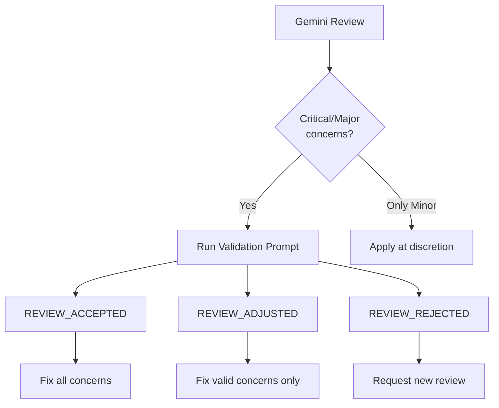

# Gemini Review Templates

## MCP Tools

- `gemini-review-file`: Single file review
- `gemini-review-files`: Multi-file review with context
- `gemini-query`: General queries

---

## Standard Review Prompt

```
Review this implementation with an extremely critical and meticulous attitude.

Evaluate against:
- Feature-based Architecture compliance
- TypeScript strict type safety (no `any`)
- Component composition patterns
- Custom hooks for logic extraction
- Design consistency (shared layouts, spacing)
- Accessibility (a11y)
- Performance considerations

Identify ALL concerns, no matter how minor.
```

---

## Phase-Specific Templates

### Phase 1: Analysis Review

```
Analyze this codebase investigation.

Evaluate:
- Completeness of analysis
- Accuracy of pattern identification
- Missed architectural concerns
- Suggested approach viability

Provide:
1. Strengths of current codebase
2. Concerns to address
3. Recommendations for implementation
```

### Phase 2: Design Review

```
Review this design with an extremely critical attitude.

Evaluate:
- Type definitions completeness
- Interface design (props, return types)
- Component hierarchy appropriateness
- Hook design (separation of concerns)
- Zod schema correctness

Identify:
1. Design flaws
2. Missing types
3. Potential extensibility issues
```

### Phase 3: Implementation Review

```
Review this implementation with an extremely critical and meticulous attitude.

Evaluate against:
- Feature-based Architecture compliance
- TypeScript strict type safety (no `any`)
- Component composition patterns
- Custom hooks for logic extraction
- Design consistency (PageContainer, PageHeader, spacing)
- Accessibility (semantic HTML, ARIA, keyboard nav)
- Performance (memo, callback, lazy loading)
- TDD compliance (tests exist and pass)

Identify ALL concerns, no matter how minor.
Format: List each concern with severity (Critical/Major/Minor).
```

### Component Review

```
Review this React component critically.

Evaluate:
- Props interface design
- Component composition
- Hook usage
- State management
- Event handling
- Accessibility
- Performance (unnecessary re-renders)
- Error boundaries

Identify ALL concerns.
```

### Hook Review

```
Review this custom hook critically.

Evaluate:
- Return type design
- Dependency array correctness
- Error handling
- Loading state management
- Cache invalidation (if using TanStack Query)
- Side effect cleanup
- TypeScript types

Identify ALL concerns.
```

### Test Review

```
Review these tests critically.

Evaluate:
- Test coverage completeness
- User-centric testing (Testing Library)
- Accessibility testing
- Edge case handling
- Mock usage appropriateness
- AAA pattern compliance
- Async handling

Identify:
1. Missing test cases
2. Weak assertions
3. Implementation details testing (anti-pattern)
```

---

## Response Format Request

Add this to get structured responses:

```
Format your response as:

## Summary
[One-line assessment: APPROVED / NEEDS_REVISION]

## Concerns
- [Critical] ...
- [Major] ...
- [Minor] ...

## Recommendations
1. ...
2. ...
```

---

## Review Validation

After receiving Gemini's review, validate the review itself.

### Validation Prompt

```
Evaluate the validity of the following code review.

## Code Under Review
[Paste the code]

## Review Result
[Paste Gemini's review]

## Validation Criteria

For each concern raised, evaluate:

1. **Accuracy**: Is the concern technically correct?
   - Does the issue actually exist in the code?
   - Is the technical reasoning sound?

2. **Relevance**: Is the concern relevant to this context?
   - Does it apply to the actual requirements?
   - Is it appropriate for the project scope?

3. **Severity**: Is the severity rating appropriate?
   - Critical: Would cause runtime errors or security issues
   - Major: Violates architecture/patterns, hard to fix later
   - Minor: Style, optimization, nice-to-have

4. **Missed Issues**: Are there concerns NOT raised that should be?
   - Accessibility violations
   - Type safety issues
   - Performance problems

## Response Format

For each concern:
- [VALID] Concern is accurate and appropriately rated
- [INVALID] Concern is incorrect or irrelevant - explain why
- [SEVERITY_ADJUST] Correct concern but wrong severity - suggest new level

Missed issues (if any):
- [MISSED] Description of overlooked concern

Final verdict:
- REVIEW_ACCEPTED: Review is valid, proceed with fixes
- REVIEW_ADJUSTED: Some concerns invalid/adjusted, use corrected list
- REVIEW_REJECTED: Review has fundamental errors, re-review needed
```

### When to Validate

- **Always validate** Critical concerns before acting
- **Validate** when concerns seem overly strict or incorrect
- **Skip validation** for Minor concerns (optional fixes)

### Validation Flow



---

## Iteration Pattern

When concerns are found:

```
The following concerns were raised in the previous review:
[List concerns]

Verify that ALL concerns have been addressed.
If any remain unresolved, list them again.
If all resolved, respond with "No concerns."
```
