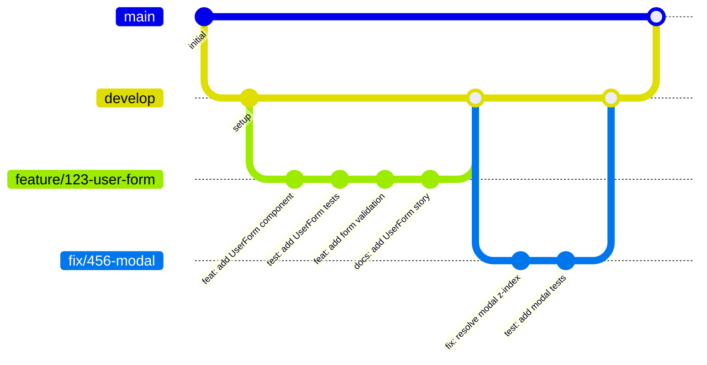
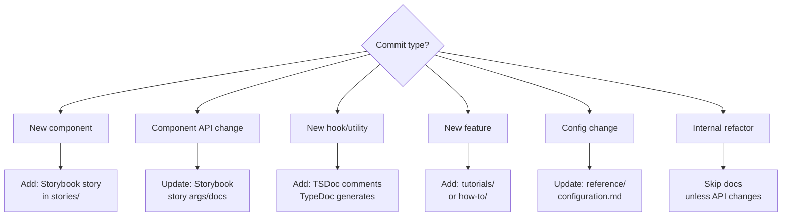
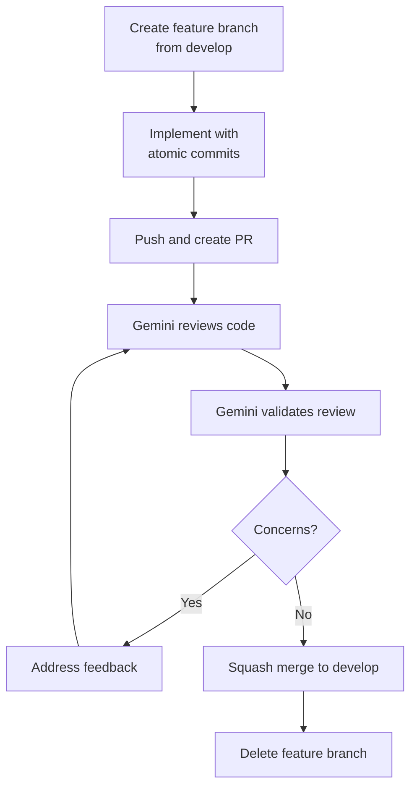
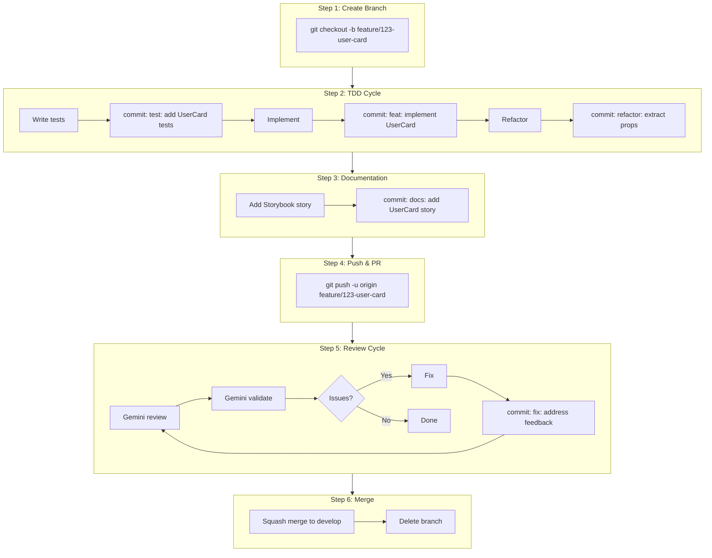

# Git Workflow

## Branch Strategy

### Branch Types

| Type | Pattern | Purpose | Lifetime |
|------|---------|---------|----------|
| `main` | `main` | Production-ready code | Permanent |
| `develop` | `develop` | Integration branch | Permanent |
| `feature` | `feature/<ticket>-<description>` | New features | Until merged |
| `fix` | `fix/<ticket>-<description>` | Bug fixes | Until merged |
| `refactor` | `refactor/<description>` | Code improvements | Until merged |
| `docs` | `docs/<description>` | Documentation only | Until merged |

### Branch Naming

```
feature/123-user-authentication
fix/456-login-timeout
refactor/extract-validation-logic
docs/storybook-update
```

### Branch Flow



---

## Commit Strategy

### Commit Granularity

Each commit should be:
- **Atomic**: One logical change
- **Complete**: Tests pass, build succeeds
- **Documented**: Includes doc updates if needed

### Commit Types (Conventional Commits)

| Type | Description | Triggers Doc Update? |
|------|-------------|---------------------|
| `feat` | New feature/component | Yes - Storybook story |
| `fix` | Bug fix | Maybe - if behavior changes |
| `refactor` | Code restructure | No |
| `test` | Add/update tests | No |
| `docs` | Documentation only | N/A |
| `style` | Formatting, CSS | Maybe - Storybook |
| `chore` | Maintenance | No |

### Commit Message Format

```
<type>(<scope>): <description>

[body]

[footer]
```

### Examples

```bash
# Feature with Storybook
feat(user): add UserCard component

Implement UserCard with avatar, name, and email display.
Uses shadcn Card component as base.

Docs: Added Storybook story for UserCard.

# Bug fix
fix(modal): resolve z-index stacking issue

Modal was appearing behind sidebar on mobile.
Fixed by updating z-index in dialog component.

Fixes #456

# Refactor (no docs needed)
refactor(hooks): extract useFormValidation

Moved validation logic from UserForm to dedicated hook.
No behavior changes.
```

---

## Commit Checklist

Before each commit:

- [ ] Code changes complete
- [ ] Tests pass: `npm run test`
- [ ] Type check passes: `npx tsc --noEmit`
- [ ] Lint passes: `npm run lint`
- [ ] Documentation updated (if applicable)
  - [ ] New component → Add Storybook story
  - [ ] Component API change → Update story args
  - [ ] New feature → Add tutorial or how-to
  - [ ] Hook/utility change → Update TypeDoc comments

### Documentation Decision Tree



---

## Pull Request Strategy

### PR Scope

One PR should contain:
- **One feature** or **one fix**
- Related tests
- Related Storybook stories
- Max 400 lines changed (excluding auto-generated)

### PR Naming

```
feat(user): implement user profile page (#123)
fix(modal): resolve z-index issue (#456)
docs: add authentication tutorial
refactor: extract form validation hooks
```

### PR Template

```markdown
## Summary
[Brief description of changes]

## Type
- [ ] Feature
- [ ] Bug fix
- [ ] Refactor
- [ ] Documentation

## Changes
- [Change 1]
- [Change 2]

## Screenshots
[If UI changes, add before/after screenshots]

## Documentation
- [ ] No docs needed
- [ ] Storybook story added/updated
- [ ] TypeDoc comments added

## Testing
- [ ] Unit tests added/updated
- [ ] Component tests added/updated
- [ ] All tests pass

## Checklist
- [ ] Code follows project standards
- [ ] Self-reviewed
- [ ] Gemini review passed
- [ ] Accessibility checked
- [ ] Responsive design verified
```

### PR Flow



---

## Workflow Integration

### Phase 3 with Git



### Commit Frequency Guidelines

| Change Type | Commit After |
|-------------|--------------|
| Test file created | Each test file |
| Component complete | Each component |
| Hook implemented | Each hook |
| Story added | Each story |
| Bug fixed | Each fix |
