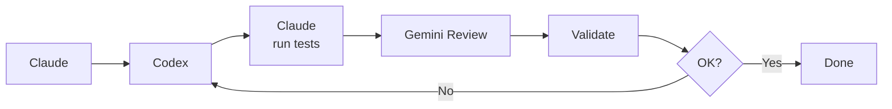
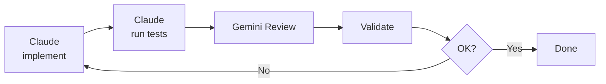
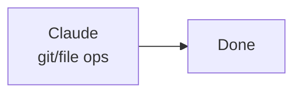
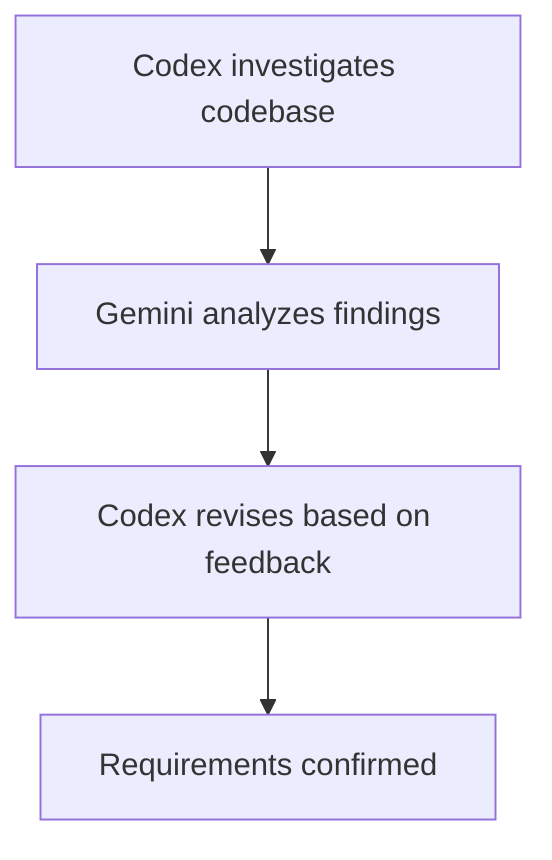
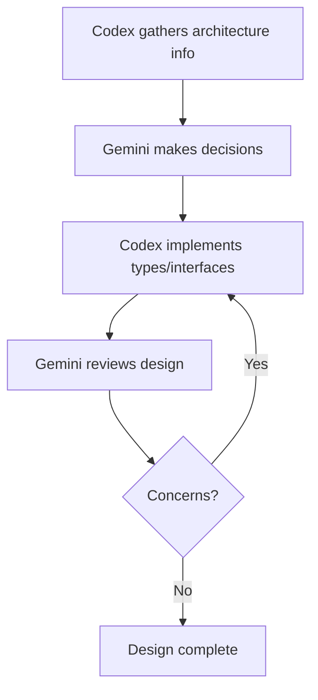
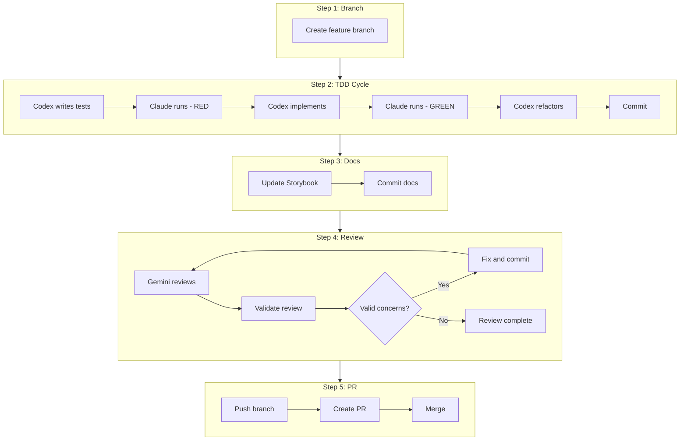
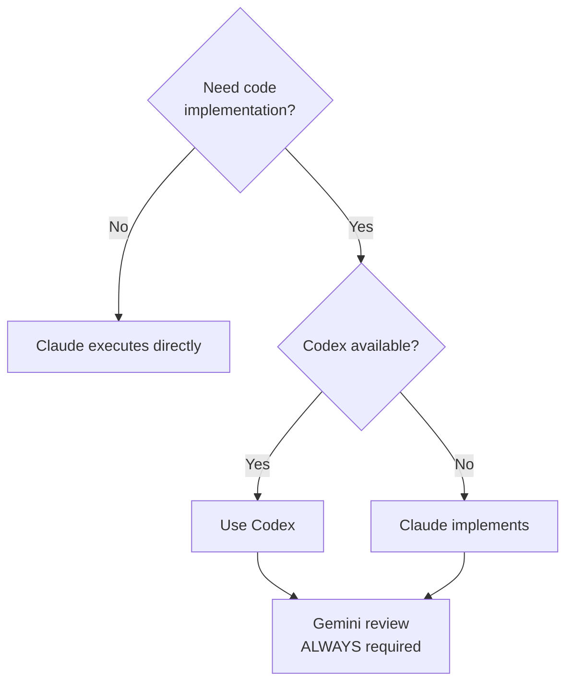
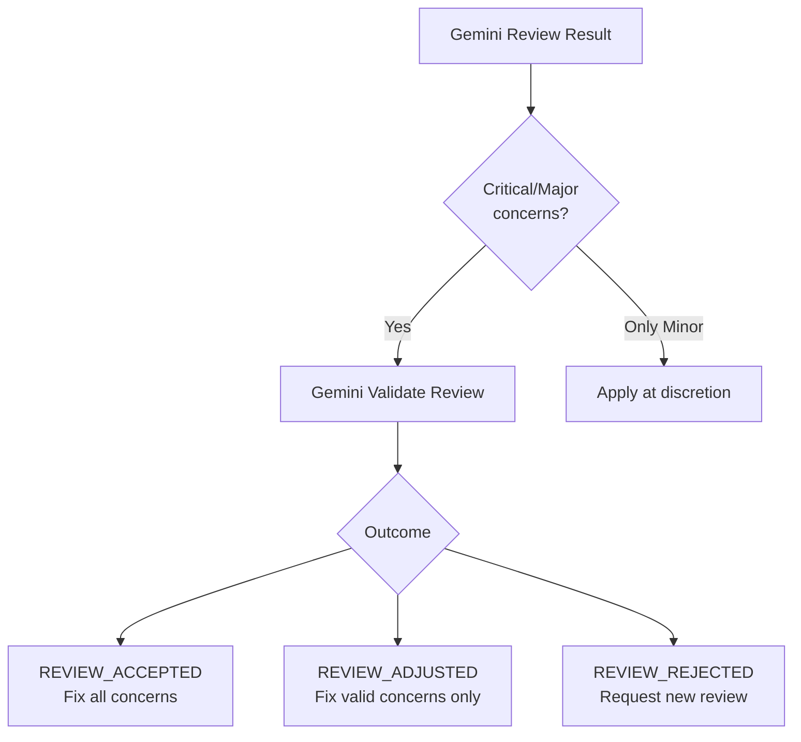

# Workflow Overview

## Agent Roles

| Agent | Role | Tools |
|-------|------|-------|
| **Claude** | Orchestration, decisions, git/file ops | Native |
| **Codex** | Code implementation | `mcp__codex__codex` |
| **Gemini** | Review, quality assessment | `gemini-review-file`, `gemini-query` |

## Execution Patterns

### Pattern A: Normal (Codex Available)

### Pattern B: Fallback (Codex Unavailable)

### Pattern C: Simple Operations (No Codex Needed)

---

## Phase Details

### Phase 1: Analysis & Requirements

**Goal**: Understand current state and confirm requirements.

### Phase 2: Design

**Goal**: Design architecture and define types/interfaces.

### Phase 3: Implementation (TDD)

**Goal**: Implement with test-first approach.

See `git-workflow.md` for branch/commit details.
See `guides/documentation.md` for doc update rules.

---

## Fallback Decision Tree

---

## Review Validation Flow

After Gemini review, validate the review itself:

See `gemini-templates.md` for validation prompt template.

---

## Notes

- **Gemini review is never skipped**, even in fallback mode
- **Always validate Critical/Major concerns** before acting on them
- **Rate limits usually recover in a few minutes** — consider waiting
- **Claude can handle simple file operations** without delegation
